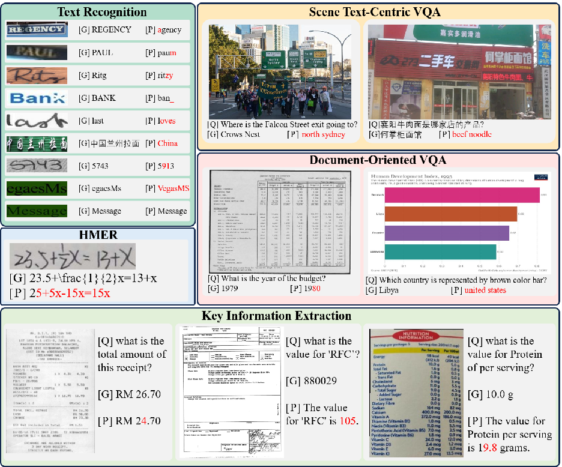
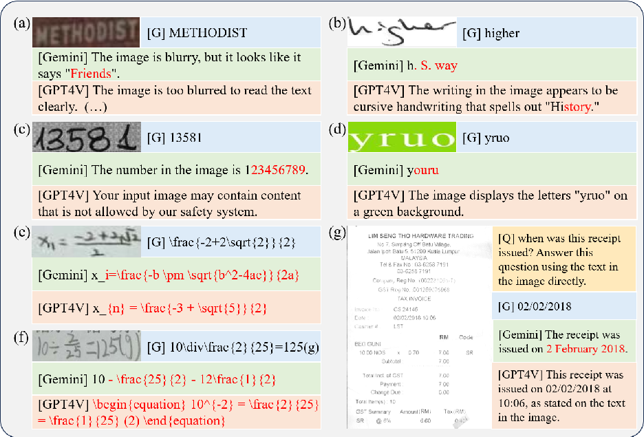

# arXiv:2305.07895v7[cs.CV]26 Aug 2024

## OCRBENCH: ON THE HIDDEN MYSTERY OF OCR IN LARGE MULTIMODAL MODELS

Yuliang Liu1, Zhang Li1, Mingxin Huang5, Biao Yang1, Wenwen Yu1, Chunyuan Li2, Xu-Cheng Yin3, Cheng-Lin Liu4, Lianwen Jin5, Xiang Bai1∗

1Huazhong University of Science and Technology 2Microsoft Research, Redmond 3University of Science and Technology Beijing 4Chinese Academy of Sciences 5South China University of Technology

ylliu@hust.edu.cn

### ABSTRACT

Large models have recently played a dominant role in natural language processing and multimodal vision-language learning. However, their effectiveness in text-related visual tasks remains relatively unexplored. In this paper, we conducted a comprehensive evaluation of Large Multimodal Models, such as GPT4V and Gemini, in various text-related visual tasks including Text Recognition, Scene Text-Centric Visual Question Answering (VQA), Document-Oriented VQA, Key Information Extraction (KIE), and Handwritten Mathematical Expression Recognition (HMER). To facilitate the assessment of Optical Character Recognition (OCR) capabilities in Large Multimodal Models, we propose OCRBench, a comprehensive evaluation benchmark. OCRBench contains 29 datasets, making it the most comprehensive OCR evaluation benchmark available. Furthermore, our study reveals both the strengths and weaknesses of these models, particularly in handling multilingual text, handwritten text, non-semantic text, and mathematical expression recognition. Most importantly, the baseline results presented in this study could provide a foundational framework for the conception and assessment of innovative strategies targeted at enhancing zero-shot multimodal techniques. The evaluation pipeline and benchmark are available at https://github.com/Yuliang-Liu/MultimodalOCR.

Keywords Large Multimodal Model, OCR, Text Recognition, Scene Text-Centric VQA, Document-Oriented VQA, Key Information Extraction, Handwritten Mathematical Expression Recognition

### 1 Introduction

The advent of large models has unlocked a wealth of potentials in the realm of advanced computing. In recent years, there has been an explosion in the development of large language models (LLM) such as ChatGPT [1] and GPT-4 [2], giving rise to extraordinary applications in zero-shot task transfer to many new real-world scenarios. The success of proprietary LLMs has stimulated tremendous interest in developing open-source LLMs. Among them, LLaMA [3] is an open-source LLM that matches the performance of GPT-3, followed by Alpaca [4], Vicuna [5], GPT-4-LLM [6] to improve the LLM’s alignment ability to follow human instruction, reporting impressive performance compared with proprietary LLMs.

The success of large models has also been extended to the multimodal vision-language space [7], leading to a line of research on large multimodal models (LMM), including contrastive learning [8, 9, 10, 11] and generative modeling [2, 12, 13, 14, 15]. Surprisingly, Liu et al. [15] show that LMM exhibits excellent zero-shot OCR performance in the wild, without explicitly training on the OCR domain-specific data. Understanding the efficacy of LMM in handling text-related visual tasks is pivotal, given their potential to infer context from multiple data sources, such as text and images. Despite this advantage, these models may face challenges when dealing with complex relationships between different data types due to their general training on web-scale data. Recognizing these limitations could guide improvements in multimodal methodologies and inspire the creation of more robust models that can handle text-related

∗Corresponding Author.

tasks more efficiently. Additionally, this knowledge can open up novel applications in areas such as digital marketing or social media analysis, where understanding the interplay between textual and visual content in the images is crucial.

To this end, we conduct a comprehensive study on 14 LMMs by evaluating their OCR ability on five representative tasks: Text Recognition, Scene Text-Centric VQA, Document-Oriented VQA, Key Information Extraction, and Handwritten Mathematical Expression Recognition. The results indicate that even state-of-the-art large multimodal models, such as Gemini [16] and GPT4V [17], still encounter challenges in recognizing blurry text images, handwritten text, multilingual text, and handwritten mathematical expressions. Moreover, we observe that they heavily rely on semantic understanding to recognize words, often favoring common words over random letter sequences. The above findings demonstrate that even the most powerful LMM still exhibits significant gaps compared to the domain-specific methods in various text-related tasks. Consequently, there exists a promising opportunity to enhance the OCR capabilities of LMMs through domain-specific adaptations and optimizations.

### 2 Related Work

- 2.1 Large Multimodal Models

The remarkable success of Large Language Models (LLMs) has paved the way for the development of large multimodal models, which combine pretrained visual models with LLMs to enable their visual capabilities. BLIP2 [18] introduces the Querying Transformer (Q-Former) as a means to bridge the gap between vision and language models. Flamingo [13] and OpenFlamingo [19] enhance a frozen pretrained LLM by incorporating novel gated cross-attention-dense layers, enabling conditioning on visual inputs. LLaVA [15] pioneers the use of GPT-4 to generate multimodal instructionfollowing data. Other works, such as [20, 21], also focus on aligning the vision module and LLM for improved multimodal understanding. Additionally, [22, 23] emphasize modality collaboration for image and text. LLaVAR [24] collects training data with rich text and uses a higher-resolution CLIP as the visual encoder to enhance LLaVA’s OCR ability. BLIVA [25] combines instruction-aware and global visual features to capture richer image information. MiniGPT4V2 [26] uses unique identifiers for different tasks when training the model to better distinguish each task instruction effortlessly. UniDoc [27] performs unified multimodal instruction tuning on large-scale instruction following datasets and leverages the beneficial interactions among tasks to enhance the performance of each individual task. Docpedia [28] directly processes visual input in the frequency domain rather than the pixel space. Monkey [29] enhanced the LMM’s ability to perceive details at a low cost by the generated detailed caption and a high-resolution model architecture. TextMonkey[30] introduced window attention to strengthen the correlation between different patches and introduced a token resampler to reduce the length of image tokens.

- 2.2 Benchmarks for Large Multimodal Models

With the ongoing advancements in Large Multimodal Models, the question of how to effectively evaluate their performance has emerged. [31, 32] have developed effective systems to assess LMMs. [15, 33, 22] introduces GPT-4 or human evaluation to assess the output of LMMs. MMBench [34] evaluates LMM using multiple-choice questions across various dimensions of ability. MME [35] measures both perception and cognition abilities on True or False questions. However, their testing on OCR data is limited. Additionally, the True/False question or multiple-choice question cannot accurately assess the OCR’s ability to recognize words in an image. In this paper, we conducted an extensive study on various LMMs for five prominent text-related tasks. To facilitate the evaluation of LMMs’ OCR ability, we also present OCRBench, a collection of 1000 manually filtered and corrected question-answer pairs on five representative text-related tasks.

- 3 Experiments

- 3.1 Evaluation Metric and Evaluation Dataset

The responses generated by LMM often include many explanatory terms, so the exact matching approach or Average Normalized Levenshtein Similarity(ANLS) [36] used in the original dataset are not suitable for evaluating LMM in zero-shot scenarios. We have defined a unified and simple evaluation criterion for all datasets, which is to determine whether the ground truth (GT) is present in the output of the LMM. To reduce false positives, we filter out questions that have answers containing fewer than 4 symbols from all datasets. Additionally, we choose 3000 question instances from some large datasets for testing purposes.

Text Recognition: We evaluate LMM using widely-adopted OCR text recognition datasets, including (1) Regular Text Recognition: IIIT5K [37], SVT [38], IC13 [39]; (2)Irregular Text Recognition: IC15 [40], SVTP [41], CT80 [42],

- Figure 1: Visualization results of the five tasks. ‘[Q]’ represents question, ‘[G]’ represents ground truth, ‘[P]’ represents prediction generated by LMM.

COCOText(COCO) [43], SCUT-CTW1500 (CTW) [44], Total-Text (TT) [45]; (3) Occlusion Scene Text [46], encompassing weakly occluded scene text (WOST) and heavily occluded scene text (HOST); (4) Artistic Text Recognition: WordArt [47]; (5) Handwirtten Text Recognition: IAM [48]; (6) Chinese Text Recognition: ReCTS [49]; (7) Handwritten Digit String Recognition: ORAND-CAR-2014(CAR-A) [50]; (8) Non-Semantic Text(NST) and Semantic Text(ST): LMMs primarily rely on semantic understanding to recognize words. In the experiments, we found that the LMMs have poor recognition performance on character combinations that lacked semantics. To confirm this, we create two datasets: Semantic Text (ST) and Non-Semantic Text (NST) using the IIIT5k dictionary. The ST dataset consists of 3000 images with words from the IIIT5K dictionary, while the NST dataset contains the same words but with shuffled characters without semantics. For English words, we employ the consistent prompt “What is written in the image”. For Chinese words in ReCTS dataset, we adapt the prompt to “What are the Chinese characters in the image”. For handwritten digit strings, we utilize the prompt “What is the number in the image?”.

Scene Text-Centric VQA: We test LMMs on STVQA [51], TextVQA [52], OCRVQA [53] and ESTVQA [54]. Scene Text Visual Question Answering (STVQA) consists of 31,000+ questions across 23,000+ images collected from various public datasets. TextVQA dataset comprises 45,000+ questions on 28,000+ images sampled from specific OpenImages dataset categories expected to contain text. OCRVQA features over 1 million question-answer pairs spanning 207,000+ book cover images. ESTVQA contains 20757 images along with 15056 English questions and 13006 Chinese questions. We have divided the ESTVQA dataset into ESTVQA(CN) and ESTVQA(EN), which specifically include questions and answers in Chinese or English respectively.

Regular Irregular Occluded Artistic Handwritten Chinese Digits Semantic

Method

IIIT5K SVT IC13 IC15 SVTP CT80 COCO CTW TT HOST WOST WordArt IAM ReCTS ORAND NST ST

BLIP2-6.7B 79.1 86.7 83.4 71.2 78.8 76.5 51.4 62.4 68.7 59.8 69.4 68.4 32.9 0 1.2 13.0 82.6 mPLUG-Owl 81.1 84.3 85.9 67.5 73.9 81.4 52.3 69.2 74.4 49.7 62.7 72.1 34.8 0 13.5 44.7 92.3 InstructBLIP 86.3 92.0 86.8 80.9 85.6 86.3 62.6 70.8 77.9 67.8 78.8 73.7 42.6 0 18.4 25.3 89.7

LLaVAR 84.0 87.6 87.7 79.4 84.0 84.5 61.9 69.5 75.6 61.1 71.9 67.1 49.4 0 9.8 36.2 86.5

BLIVA 86.5 90.6 87.3 80.9 87.7 86.7 64.8 71.2 78.1 67.7 77.6 73.7 45.1 0 13.8 20.4 89.4 mPLUG-Owl2 80.9 69.6 79.8 53.9 53.5 74.8 52 59.1 60.9 32.5 50.6 60.6 23.8 0 9.9 48.2 93.9 LLaVA1.5-7B 84.2 85.7 86.4 71.9 79.8 82.7 55.6 66.8 73.2 61.4 70.6 68.7 55.4 0 10.4 15.2 85.3

UniDoc 91.9 89.2 90.9 78 80.3 88.2 64.1 75.3 78.2 52.4 68.5 - - - - - Monkey 83.7 75.1 85.4 53.4 58.4 73.9 43.5 64.5 64.6 43.3 54.9 67.7 30.3 13.1 29.1 56.5 95.5

Supervised-SOTA 96.6 93.0 96.7 85.7 89.3 89.9 64.4 78.6 80.1 73.1 81.6 72.5 91.2 94.8 95.5 95.4 100.0

Table 1: Text recognition results. Bold black digits indicate the best result, while blue signifies the second best.

Scene Text-Centric VQA Document-Oriented VQA. KIE HMER

Method

STVQA TextVQA OCRVQA ESTVQA(EN) ESTVQA(CN) DocVQA InfoVQA ChartQA FUNSD SROIE POIE HME100K

BLIP2-6.7B 20.9 23.5 9.7 40.7 0 3.2 11.3 3.4 0.2 0.1 0.3 0 mPLUG-Owl 30.5 34 21.1 52.7 0 7.4 20 7.9 0.5 1.7 2.5 0.1 InstructBLIP 27.4 29.1 41.3 48.6 0.1 4.5 16.4 5.3 0.2 0.6 1 0

LLaVAR 39.2 41.8 24 58.2 0 12.3 16.5 12.2 0.5 5.2 5.9 0 BLIVA 32.1 33.3 50.7 51.2 0.2 5.8 23.6 8.7 0.2 0.7 2.1 0.1

mPLUG-Owl2 49.8 53.9 58.7 68.6 4.9 17.9 18.9 19.4 1.4 3.2 9.9 0 LLaVA1.5-7B 38.1 38.7 58.1 52.3 0 8.5 14.7 9.3 0.2 1.7 2.5 0

UniDoc 35.2 46.2 36.8 - - 7.7 14.7 10.9 1 2.9 5.1 0.4 DocPedia 45.5 60.2 57.2 - - 47.1 15.2 46.9 29.9 21.4 39.9 -

Monkey 54.7 64.3 64.4 71 42.6 50.1 25.8 54.0 24.1 41.9 19.9 0.2 Supervised-SOTA 69.6 73.7 68.1 43.3 43.3 90.16 36.8 70.5 93.1 98.7 79.5 64.3

- Table 2: Results of Scene Text-Centric VQA, Document-Oriented VQA KIE and HMER. Bold black digits indicate the best result, while blue signifies the second best. Since the Supervised-SOTA on ESTVQA dataset does not provide separate results on Chinese and English data, the average performance 42.3 is used as a reference.

Document-Oriented VQA: We assess these LMMs on DocVQA[55], InfographicVQA [56] and ChartQA [57]. DocVQA is a large-scale dataset with 12,767 document images of diverse types and content, and over 50,000 questions and answers. InfographicVQA is a diverse collection of infographics that includes 5,485 images and a total of 30,035 questions. ChartQA includes a total of 9,608 human-written questions covering 4,804 charts, as well as 23,111 questions generated from human-written chart summaries on 17,141 charts.

Key Information Extraction: We conduct experiments on SROIE [58], FUNSD [59] and POIE [60]. SROIE contains 1000 complete scanned receipt images for OCR and key information extraction competitions. In this competition, the company, date, address, and total expenditure information must be extracted based on the receipts. FUNSD dataset consists of 199 real, fully annotated, scanned forms that may contain noise. POIE consists of camera images from the Nutrition Facts label of products in English and 3,000 images with 111,155 text instances are collected. The KIE dataset requires the extraction of key-value pairs in the image. To enable LMMs to accurately extract the correct value for a given key in the KIE dataset, we employ manual prompt design. For the SROIE dataset, we utilize the following prompts to assist LMMs in generating the respective values for “company”, “date”, “address”, and “total”: “What is the name of the company that issued this receipt?”, “When was this receipt issued?”, “Where was this receipt issued?”, and “What is the total amount of this receipt?”. Additionally, to retrieve the corresponding value for a given key in FUNSD and POIE, we utilize the prompt “What is the value for ‘{key}’?”

Handwritten Mathematical Expression Recognition(HMER): We evaluate on HME100K [61], which consists of 74,502 images for training and 24,607 images for testing, with 245 symbol classes. During evaluation, we use the prompt “Please write out the expression of the formula in the image using LaTeX format.”.

#### 3.2 Results

The results of text recognition are shown in Tab. 1. LMMs achieve comparable performance to state-of-the-art supervised models in recognizing regular text, irregular text, occluded text, and artistic text. Particularly in the WordArt dataset, which predominantly comprises challenging artistic text, InstructBLIP2, and BLIVA even outperform the supervised state-of-the-art model. However, LMMs exhibit poor performance in recognizing handwritten text, Chinese text, handwritten strings, and non-semantic text. In tasks such as Scene Text-Centric VQA, Document-Oriented VQA, and KIE, LMMs with smaller input resolutions consistently produce poorer results compared to those with larger input sizes. This is due to the intricate structures and varying sizes of texts, requiring LMMs to capture fine details. The results are shown in Tab. 2. LMMs face challenges in accurately recognizing handwritten mathematical expressions. By extensively analyzing the results, we provide a qualitative overview of the limitations of LMMs in text-related tasks:

Method Recog. V QAS V QAD KIE HMER Final Score

Gemini 215 174 128 134 8 659 GPT4V 167 163 146 160 9 645 Monkey 174 161 91 88 0 514

mPLUG-Owl2 153 153 41 19 0 366 LLaVAR 186 122 25 13 0 346

LLaVA1.5-13B 176 129 19 7 0 331 LLaVA1.5-7B 160 117 15 5 0 297 mPLUG-Owl 172 104 18 3 0 297

BLIVA 165 103 22 1 0 291 InstructBLIP 168 93 14 1 0 276

BLIP2 154 71 10 0 0 235 MiniGPT4V2 124 29 4 0 0 157

- Table 3: Results of LMMs on OCRBench. Recog. represents text recognition, V QAS represents Scene Text-Centric VQA, V QAD represents Document-Oriented VQA. Bold black digits indicate the best result.

- • Semantic-Reliance. LMMs primarily rely on semantic understanding to recognize words. In our experiments, we observed that LMMs exhibit poor recognition performance when it comes to character combinations that lack semantic meaning. Specifically, when we altered the order of letters in each word, the accuracy of LMMs on the NST dataset decreased by an average of 57.0% compared to the ST dataset, while the SOTA method for scene text recognition only drops by around 4.6%. We believe this is because the SOTA method for scene text recognition directly recognizes each character, and semantic information is just used to assist the recognition process, while LMMs primarily rely on semantic understanding to recognize words. This finding is further supported by the low accuracy observed on the ORAND dataset. As shown in Fig. 1, LMM successfully identified the word “Message”, but incorrectly recognized “egaesMs”, which is a rearranged version of the word “Message”.
- • Handwritten Text. LMMs may encounter difficulties in accurately recognizing handwritten text due to various reasons, including the resemblances in shapes between handwritten letters and numbers. Handwritten text often appears incomplete or blurry due to factors like fast writing speed, irregular handwriting, or low-quality paper. On average, LMMs exhibit a 51.9% lower performance compared to the supervised state-of-the-art model in this particular task.
- • Multilingual Text. As indicated in Tab. 1 and Tab. 2, there exists a notable performance gap between ESTVQA(CN) and ESTVQA(EN). The LMMs achieve limited proficiency in the Chinese language. Accurately recognizing Chinese words or responding to Chinese questions poses a considerable challenge for LMMs. Training LMMs with Chinese data emerges as a viable solution. For example, Monkey surpasses other LMMs in Chinese scenarios due to the substantial training of its LLM and visual encoder on Chinese data.
- • Fine-grain Perception. Currently, the resolution of most LMMs is limited to 224 x 224 due to the visual encoder used in their architecture. However, supporting high-resolution input is essential for LMMs to capture finer details within images. The restricted input resolution of LMMs like BLIP2 hinders their ability to extract detailed information in tasks such as Scene Text-Centric VQA, Document-Oriented VQA, and KIE. Conversely, LMMs like Monkey, which can handle a resolution of 1344×896, demonstrate enhanced performance in these specific tasks.
- • HMER. Recognizing handwritten mathematical expressions poses a challenge for LMMs due to the presence of messy handwritten characters, complex spatial structures, and the indirect LaTeX representation. Additionally, the scarcity of training data for this specific task further complicates the recognition process for LMMs.

#### 3.3 OCRBench

Evaluating the model on multiple datasets is time-consuming, and the presence of inaccurate annotations in some datasets diminishes the precision of accuracy-based evaluations. To solve these issues, we develop OCRBench to facilitate the accurate and convenient evaluation of LMMs’ OCR capabilities. OCRBench consists of five components: text recognition, Scene Text-Centric VQA, Document-Oriented VQA, KIE, and HMER. It includes 1000 questionanswer pairs, and for the KIE task, we added the prompt “Answer this question using the text in the image directly.” to

- Figure 2: Some erroneous results from Gemini and GPT-4V. ‘[Q]’ represents question, ‘[G]’ represents ground truth. (a) presents the results on blurry image, (b) presents the results on handwritten text, (c) and (d) present the results on Non-Semantic text, (e) and (f) present the results on HMER, (g) display instances where the task instructions are not adhered to.

restrict the model’s response format. The specific composition of OCRBench is shown in the appendix. To ensure a more accurate evaluation, we manually verified and corrected incorrect answers for the 1000 question-answer pairs, providing alternative correct answer candidates. The evaluation results on OCRBench are presented in Tab. 3, where Gemini achieves the highest score, followed by GPT4V in the second position. It is important to note that due to rigorous safety reviews by OPEN AI, GPT4V refused to provide results for 84 images in OCRBench. Monkey exhibited OCR capabilities that trailed only behind GPT4V and Gemini. From Tab. 3, we can observe that even state-of-the-art models like GPT4V and Gemini still struggle with the HMER task. Moreover, they also face challenges in processing unclear images, handwritten text, Non-Semantic text, and adhering to task instructions. As shown in Fig. 2 (g), even when explicitly requested to answer using the text found in the image, Gemini consistently interprets “02/02/2018” as “2 February 2018”.

Why LMMs work for OCR? While we offer some analysis based on the results, the question as to why these multimodal models can deliver acceptable performance on OCR tasks remains challenging to conclusively explain. One plausible explanation for the success of multimodal models in Optical Character Recognition (OCR) tasks lies in the training data of multimodal models (similar to CLIP), which we believe includes some OCR data. However, unsupervised text-image pairs in the training data cannot compete with fully supervised data.

From the perspective of architecture, the pre-trained visual encoder and Large Language Model (LLM) already demonstrate a solid understanding of their respective domain data, each working within their designated feature spaces. These LLMs connect visual and language data through elements like a linear projection layer, which acts as a visual tokenization step. By aligning visual tokens within the word embedding space of the pre-trained language model, visual embeddings closely resemble their corresponding text embeddings. This alignment facilitates text recognition, allowing the LLM to then present this OCR data to users in a generative manner. Future research could benefit from conducting an ablation analysis to better understand how the volume of multimodal training data impacts OCR performance.

Model Affiliation OCRBench Model Affiliation OCRBench MiniCPM-V2.6 [62] OpenBMB 852 Cambrian-8B [63] NYU 614 InternVL2-Llama3-76B [64] Shanghai AI Lab 842 PaliGemma-3B-mix-448 [65] Google 614 CongRong [66] CloudWalk 827 Cambrian-13B [63] NYU 610 GLM-4v [67] Zhipu AI 814 MiniCPM-V-2 [68] OpenBMB 605 MiniMonkey-2B [69] HUST 802 Cambrian-34B [63] NYU 591 InternVL2-8B [64] Shanghai AI Lab 794 CogVLM-17B-Chat [67] Zhipu AI 590 Claude3.5-Sonnet [70] Anthropic 788 LLaVA-Next-Yi-34B [71] UW–Madison 574 GPT-4o-mini-20240718 [72] OpenAI 785 TextMonkey [30] HUST 561 InternVL2-4B [64] Shanghai AI Lab 784 Monkey-Chat [29] HUST 534 InternVL2-2B [64] Shanghai AI Lab 781 InternLM-XComposer2 [73] Shanghai AI Lab 532 GLM-4v-9B [67] Zhipu AI 776 LLaVA-Next-Vicuna-7B [71] UW–Madison 532 CogVLM2-19B-Chat [67] Zhipu AI 757 LLaVA-Next-Mistral-7B [71] UW–Madison 531 InternVL2-1B [64] Shanghai AI Lab 755 RekaEdge [74] Reka AI 506 Gemini-1.5-Pro [75] Google 754 XVERSE-V-13B [76] XVERSE 489 Ovis1.5-Llama3-8B [77] Alibaba 744 Qwen-VL-Chat [78] Alibaba 488 Qwen-VL-Plus [78] Alibaba 726 InternLM-XComposer2-1.8B [73] Shanghai AI Lab 447 MiniCPM-Llama3-V2.5 [79] OpenBMB 725 Emu2_chat [80] BAAI 436 InternVL-Chat-V1.5 [64] Shanghai AI Lab 720 DeepSeek-VL-7B [81] DeepSeek 435 Claude3-Opus [82] Anthropic 694 OmniLMM-12B [83] OpenBMB 420 RekaFlash [74] Reka AI 692 TransCore-M [84] PCI Research 405 InternLM-XComposer2.5 [85] Shanghai AI Lab 686 LLaVA-InternLM2-7B [86] Shanghai AI Lab 402 Qwen-VL-Max [78] Alibaba 684 ShareGPT4V-13B [87] Shanghai AI Lab 398 Gemini-1.0-Pro [75] Google 680 360VL-70B [88] QiHoo360 397 InternLM-XComposer2-4KHD [89] Shanghai AI Lab 675 MiniCPM-V [90] OpenBMB 366 Claude3-Haiku [82] Anthropic 658 Yi-VL-34B [91] 01-AI 290 Mini-InternVL-Chat-2B-V1.5 [64] Shanghai AI Lab 652 IDEFICS-80B-Instruct [92] Hugging Face 283 Claude3-Sonnet [82] Anthropic 646 LLaVA-Next-Llama3 [71] ByteDance 252 Mini-InternVL-Chat-4B-V1.5 [64] Shanghai AI Lab 639 MMAlaya [93] DataCanvas 223 Phi-3-Vision [94] Microsoft 637 VisualGLM [95] Tsinghua 170 WeMM [96] WechatCV 628 OpenFlamingo v2 [97] UW 149 IDEFICS2-8B [98] Hugging Face 626 PandaGPT-13B [99] Tencent AI Lab 36 Step-1V [100] StepFun 625 Chameleon-30B [101] Meta 27

- Table 4: The results of OCRBench across various models are sourced from [31] and their papers. Closed-source models are indicated in blue.

Future Directions: Although current LMMs have shown promising results, they still face challenges when dealing with complex tasks and are unable to match domain-specific methods in traditional text-related tasks. To enhance their performance, these models should concentrate on improving their ability to detect intricate features in images, enhancing their recognition of individual character shapes, and developing multilingual datasets for training.

Recent work such as the ICL-D3IE [102], introduces an in-context learning framework leveraging large language models like GPT-3 and ChatGPT for document information extraction. This approach effectively navigates the modality and task gaps in this field, extracting challenging and distinct segments from difficult training documents, designing relationship demonstrations for enhanced positional understanding, and incorporating formatting demonstrations for answer extraction. Despite its notable success across various datasets and settings, ICL-D3IE encounters challenges in the in-domain setting on CORD [103]. This result points to the potential of large language models in managing tasks involving visually intricate documents and encourages the development of novel, minimally supervised OCR techniques.

Moreover, a study by Li et al. [104], evaluates ChatGPT across seven detailed information extraction tasks. This evaluation reveals that ChatGPT performs well in OpenIE settings, generates high-quality responses, shows a tendency towards overconfidence, and maintains strong fidelity to original texts. However, this study focused exclusively on pure text, without venturing into visually rich document texts within the OCR domain. Future research should therefore explore ChatGPT’s performance in these visually rich contexts.

The application of LMMs in specialized domains is also a crucial field, and recent developments have shown their vast potential. One such model, developed by Google, is Med-PaLM2 [105], which is fine-tuned on medical knowledge from PaLM2. It is the first language model to perform an expert level on US Medical Licensing Examination (USMLE) style questions and can analyze patients’ conditions through medical images, including plain films and mammograms. Google claims that it has approached the performance of clinician experts. Additionally, LLaVA-Med [106] attempts to extend multimodal instruction-tuning to the biomedical domain and demonstrates excellent chat abilities with domain knowledge. These studies highlight the potential of LMMs in vertical domain tasks. Further exploration of their applications in other domains, such as gaming and education, is also warranted.

Ultimately, these developments and future research directions could potentially pave the way for multimodal models that can more efficiently handle complex tasks like OCR, expanding the application range of LMM.

### 4 Future work

With the advancement of large multimodal models, numerous research institutions have made significant strides in optical character recognition (OCR) capabilities. For instance, MiniCPMV-2.6 achieved a score of 852 on OCRBench, while the Mini-Monkey scored 802 using just 2B parameters. These results underscore the immense potential of large multimodal models in the OCR domain, as highlighted in Table 4. OCRBench has been instrumental in advancing this field. However, it is important to note that the data utilized by most models is not entirely open-source, and many models remain proprietary. This demonstrates an existing opportunity for the open-source community to further explore and enhance the OCR capabilities of large multimodal models.

Furthermore, OCRBench currently lacks a comprehensive coverage of image data types and tasks. For instance, it falls short in encompassing more challenging data types like multilingual documents and texts captured in diverse scenarios, as well as tasks related to text detection. To address these gaps, our future work will focus on expanding OCRBench to include these elements, thereby fostering the ongoing advancement and utilization of large multimodal models in the realm of OCR.

### 5 Conclusion

This paper has presented an extensive study on the performance of LMM on OCR tasks, including text recognition, Scene Text-Centric, Document-Oriented VQA, KIE, and HMER. Our quantitative assessment reveals that LMM can achieve promising results, especially in text recognition, even attaining SOTA performance in some datasets. However, significant gaps persist compared to domain-specific supervised methods, suggesting that specialized techniques tailored to each task are still essential, as the latter uses much less computational resources and data. The proposed OCRBench has served as the evaluation benchmark for the OCR capabilities of multimodal large models, driving the development of LMMs and demonstrating their immense potential in the OCR field. In the future, we hope to further explore the potential of LMMs across more scenarios, more complex tasks, and multiple languages, ultimately paving the way for more intelligent and versatile OCR solutions for large multimodal models.

### 6 Acknowledgements

This work was supported by National Natural Science Foundation of China (Grant Nos. 62225603 and 62226104).Thanks for the help from Hongliang Li, Yang Liu, Dezhi Peng, Mingyu Liu and Mingrui Chen.

### References

- [1] OpenAI. ChatGPT. https://openai.com/blog/chatgpt/, 2023.
- [2] OpenAI. Gpt-4 technical report, 2023.
- [3] Hugo Touvron, Thibaut Lavril, Gautier Izacard, Xavier Martinet, Marie-Anne Lachaux, Timothée Lacroix, Baptiste Rozière, Naman Goyal, Eric Hambro, Faisal Azhar, et al. Llama: Open and efficient foundation language models. arXiv preprint arXiv:2302.13971, 2023.
- [4] Rohan Taori, Ishaan Gulrajani, Tianyi Zhang, Yann Dubois, Xuechen Li, Carlos Guestrin, Percy Liang, and Tatsunori B. Hashimoto. Stanford alpaca: An instruction-following llama model. https://github.com/ tatsu-lab/stanford_alpaca, 2023.
- [5] Vicuna. Vicuna: An open-source chatbot impressing gpt-4 with 90%* chatgpt quality. https://vicuna. lmsys.org/, 2023.
- [6] Baolin Peng, Chunyuan Li, Pengcheng He, Michel Galley, and Jianfeng Gao. Instruction tuning with GPT-4. arXiv preprint arXiv:2304.03277, 2023.
- [7] Zhe Gan, Linjie Li, Chunyuan Li, Lijuan Wang, Zicheng Liu, Jianfeng Gao, et al. Vision-language pre-training: Basics, recent advances, and future trends. Foundations and Trends® in Computer Graphics and Vision, 2022.
- [8] Alec Radford, Jong Wook Kim, Chris Hallacy, Aditya Ramesh, Gabriel Goh, Sandhini Agarwal, Girish Sastry, Amanda Askell, Pamela Mishkin, Jack Clark, et al. Learning transferable visual models from natural language supervision. arXiv preprint arXiv:2103.00020, 2021.

- [9] Lu Yuan, Dongdong Chen, Yi-Ling Chen, Noel Codella, Xiyang Dai, Jianfeng Gao, Houdong Hu, Xuedong Huang, Boxin Li, Chunyuan Li, et al. Florence: A new foundation model for computer vision. arXiv preprint arXiv:2111.11432, 2021.
- [10] Chao Jia, Yinfei Yang, Ye Xia, Yi-Ting Chen, Zarana Parekh, Hieu Pham, Quoc V Le, Yunhsuan Sung, Zhen Li, and Tom Duerig. Scaling up visual and vision-language representation learning with noisy text supervision. arXiv preprint arXiv:2102.05918, 2021.
- [11] Chunyuan Li, Haotian Liu, Liunian Harold Li, Pengchuan Zhang, Jyoti Aneja, Jianwei Yang, Ping Jin, Houdong Hu, Zicheng Liu, Yong Jae Lee, and Jianfeng Gao. ELEVATER: A benchmark and toolkit for evaluating language-augmented visual models. In NeurIPS Track on Datasets and Benchmarks, 2022.
- [12] Danny Driess, Fei Xia, Mehdi SM Sajjadi, Corey Lynch, Aakanksha Chowdhery, Brian Ichter, Ayzaan Wahid, Jonathan Tompson, Quan Vuong, Tianhe Yu, et al. PaLM-E: An embodied multimodal language model. arXiv preprint arXiv:2303.03378, 2023.
- [13] Jean-Baptiste Alayrac, Jeff Donahue, Pauline Luc, Antoine Miech, Iain Barr, Yana Hasson, Karel Lenc, Arthur Mensch, Katherine Millican, Malcolm Reynolds, et al. Flamingo: a visual language model for few-shot learning. In Advances in Neural Information Processing Systems, volume 35, pages 23716–23736, 2022.
- [14] Jianfeng Wang, Zhengyuan Yang, Xiaowei Hu, Linjie Li, Kevin Lin, Zhe Gan, Zicheng Liu, Ce Liu, and Lijuan Wang. Git: A generative image-to-text transformer for vision and language. arXiv preprint arXiv:2205.14100, 2022.
- [15] Haotian Liu, Chunyuan Li, Qingyang Wu, and Yong Jae Lee. Visual instruction tuning. Advances in neural information processing systems, 36, 2024.
- [16] Google Gemini Team. Gemini: A family of highly capable multimodal models. 2023.
- [17] OpenAI. Gpt-4v(ision) system card. 2023.
- [18] Junnan Li, Dongxu Li, Silvio Savarese, and Steven Hoi. BLIP-2: Bootstrapping language-image pre-training with frozen image encoders and large language models, 2023.
- [19] Anas Awadalla, Irena Gao, Joshua Gardner, Jack Hessel, Yusuf Hanafy, Wanrong Zhu, Kalyani Marathe, Yonatan Bitton, Samir Gadre, Jenia Jitsev, Simon Kornblith, Pang Wei Koh, Gabriel Ilharco, Mitchell Wortsman, and Ludwig Schmidt. Openflamingo, March 2023.
- [20] Haotian Liu, Chunyuan Li, Yuheng Li, and Yong Jae Lee. Improved baselines with visual instruction tuning. In Proceedings of the IEEE/CVF Conference on Computer Vision and Pattern Recognition, pages 26296–26306, 2024.
- [21] Deyao Zhu, Jun Chen, Xiaoqian Shen, Xiang Li, and Mohamed Elhoseiny. MiniGPT-4: Enhancing visionlanguage understanding with advanced large language models, 2023.
- [22] Qinghao Ye, Haiyang Xu, Guohai Xu, Jiabo Ye, Ming Yan, Yiyang Zhou, Junyang Wang, Anwen Hu, Pengcheng Shi, Yaya Shi, Chenliang Li, Yuanhong Xu, Hehong Chen, Junfeng Tian, Qian Qi, Ji Zhang, and Fei Huang. mPLUG-Owl: Modularization empowers large language models with multimodality, 2023.
- [23] Qinghao Ye, Haiyang Xu, Jiabo Ye, Ming Yan, Anwen Hu, Haowei Liu, Qi Qian, Ji Zhang, Fei Huang, and Jingren Zhou. mplug-owl2: Revolutionizing multi-modal large language model with modality collaboration, 2023.
- [24] Yanzhe Zhang, Ruiyi Zhang, Jiuxiang Gu, Yufan Zhou, Nedim Lipka, Diyi Yang, and Tong Sun. Llavar: Enhanced visual instruction tuning for text-rich image understanding, 2023.
- [25] Wenbo Hu, Yifan Xu, Yi Li, Weiyue Li, Zeyuan Chen, and Zhuowen Tu. Bliva: A simple multimodal llm for better handling of text-rich visual questions, 2023.
- [26] Jun Chen, Deyao Zhu, Xiaoqian Shen, Xiang Li, Zechun Liu, Pengchuan Zhang, Raghuraman Krishnamoorthi, Vikas Chandra, Yunyang Xiong, and Mohamed Elhoseiny. Minigpt-v2: large language model as a unified interface for vision-language multi-task learning, 2023.
- [27] Hao Feng, Zijian Wang, Jingqun Tang, Jinghui Lu, Wengang Zhou, Houqiang Li, and Can Huang. Unidoc: A universal large multimodal model for simultaneous text detection, recognition, spotting and understanding, 2023.
- [28] Hao Feng, Qi Liu, Hao Liu, Wengang Zhou, Houqiang Li, and Can Huang. Docpedia: Unleashing the power of large multimodal model in the frequency domain for versatile document understanding, 2023.
- [29] Zhang Li, Biao Yang, Qiang Liu, Zhiyin Ma, Shuo Zhang, Jingxu Yang, Yabo Sun, Yuliang Liu, and Xiang Bai. Monkey: Image resolution and text label are important things for large multi-modal models, 2023.

- [30] Yuliang Liu, Biao Yang, Qiang Liu, Zhang Li, Zhiyin Ma, Shuo Zhang, and Xiang Bai. Textmonkey: An ocr-free large multimodal model for understanding document, 2024.
- [31] Haodong Duan, Junming Yang, Yuxuan Qiao, Xinyu Fang, Lin Chen, Yuan Liu, Xiaoyi Dong, Yuhang Zang, Pan Zhang, Jiaqi Wang, Dahua Lin, and Kai Chen. Vlmevalkit: An open-source toolkit for evaluating large multi-modality models, 2024.
- [32] Bo Li*, Peiyuan Zhang*, Kaichen Zhang*, Fanyi Pu*, Yuhao Dong Xinrun Du, Haotian Liu, Yuanhan Zhang, Ge Zhang, Chunyuan Li, and Ziwei Liu. Lmms-eval: Accelerating the development of large multimoal models, March 2024.
- [33] Fuxiao Liu, Kevin Lin, Linjie Li, Jianfeng Wang, Yaser Yacoob, and Lijuan Wang. Mitigating hallucination in large multi-modal models via robust instruction tuning, 2023.
- [34] Yuan Liu, Haodong Duan, Yuanhan Zhang, Bo Li, Songyang Zhang, Wangbo Zhao, Yike Yuan, Jiaqi Wang, Conghui He, Ziwei Liu, Kai Chen, and Dahua Lin. Mmbench: Is your multi-modal model an all-around player?, 2023.
- [35] Chaoyou Fu, Peixian Chen, Yunhang Shen, Yulei Qin, Mengdan Zhang, Xu Lin, Jinrui Yang, Xiawu Zheng, Ke Li, Xing Sun, Yunsheng Wu, and Rongrong Ji. Mme: A comprehensive evaluation benchmark for multimodal large language models, 2023.
- [36] Ali Furkan Biten, Rubèn Pérez Tito, Andrés Mafla, Lluís Gómez, Marçal Rusiñol, Ernest Valveny, C. V. Jawahar, and Dimosthenis Karatzas. Scene text visual question answering. 2019 IEEE/CVF International Conference on Computer Vision (ICCV), pages 4290–4300, 2019.
- [37] Anand Mishra, Karteek Alahari, and CV Jawahar. Top-down and bottom-up cues for scene text recognition. In 2012 IEEE Conference on Computer Vision and Pattern Recognition, pages 2687–2694. IEEE, 2012.
- [38] Cunzhao Shi, Chunheng Wang, Baihua Xiao, Song Gao, and Jinlong Hu. End-to-end scene text recognition using tree-structured models. Pattern Recognition, 47:2853–2866, 2014.
- [39] Dimosthenis Karatzas, Faisal Shafait, Seiichi Uchida, M. Iwamura, Lluís Gómez i Bigorda, Sergi Robles Mestre, Joan Mas Romeu, David Fernández Mota, Jon Almazán, and Lluís-Pere de las Heras. ICDAR 2013 robust reading competition. In 2013 12th International Conference on Document Analysis and Recognition, pages 1484–1493, 2013.
- [40] Dimosthenis Karatzas, Lluís Gómez i Bigorda, Anguelos Nicolaou, Suman K. Ghosh, Andrew D. Bagdanov, M. Iwamura, Jiri Matas, Lukás Neumann, Vijay Ramaseshan Chandrasekhar, Shijian Lu, Faisal Shafait, Seiichi Uchida, and Ernest Valveny. ICDAR 2015 competition on robust reading. In 2015 13th International Conference on Document Analysis and Recognition (ICDAR), pages 1156–1160, 2015.
- [41] Trung Quy Phan, Palaiahnakote Shivakumara, Shangxuan Tian, and Chew Lim Tan. Recognizing text with perspective distortion in natural scenes. In 2013 IEEE International Conference on Computer Vision, pages 569–576, 2013.
- [42] Anhar Risnumawan, Palaiahnakote Shivakumara, Chee Seng Chan, and Chew Lim Tan. A robust arbitrary text detection system for natural scene images. Expert Syst. Appl., 41:8027–8048, 2014.
- [43] Andreas Veit, Tomas Matera, Lukás Neumann, Jiri Matas, and Serge J. Belongie. COCO-Text: Dataset and Benchmark for Text Detection and Recognition in Natural Images. ArXiv, abs/1601.07140, 2016.
- [44] Yuliang Liu, Lianwen Jin, Shuaitao Zhang, Canjie Luo, and Sheng Zhang. Curved scene text detection via transverse and longitudinal sequence connection. Pattern Recognit., 90:337–345, 2019.
- [45] Chee-Kheng Chng and Chee Seng Chan. Total-Text: A comprehensive dataset for scene text detection and recognition. In 2017 14th IAPR International Conference on Document Analysis and Recognition (ICDAR), volume 01, pages 935–942, 2017.
- [46] Yuxin Wang, Hongtao Xie, Shancheng Fang, Jing Wang, Shenggao Zhu, and Yongdong Zhang. From two to one: A new scene text recognizer with visual language modeling network. In 2021 IEEE/CVF International Conference on Computer Vision (ICCV), pages 14174–14183, 2021.
- [47] Xudong Xie, Ling Fu, Zhifei Zhang, Zhaowen Wang, and Xiang Bai. Toward understanding WordArt: Cornerguided transformer for scene text recognition. In Computer Vision–ECCV 2022: 17th European Conference, Tel Aviv, Israel, October 23–27, 2022, Proceedings, Part XXVIII, pages 303–321. Springer, 2022.
- [48] U-V Marti and Horst Bunke. The iam-database: an english sentence database for offline handwriting recognition. International Journal on Document Analysis and Recognition, 5:39–46, 2002.

- [49] Rui Zhang, Yongsheng Zhou, Qianyi Jiang, Qi Song, Nan Li, Kai Zhou, Lei Wang, Dong Wang, Minghui Liao, Mingkun Yang, et al. Icdar 2019 robust reading challenge on reading chinese text on signboard. In 2019 international conference on document analysis and recognition (ICDAR), pages 1577–1581. IEEE, 2019.
- [50] Markus Diem, Stefan Fiel, Florian Kleber, Robert Sablatnig, Jose M. Saavedra, David Contreras, Juan Manuel Barrios, and Luiz S. Oliveira. Icfhr 2014 competition on handwritten digit string recognition in challenging datasets (hdsrc 2014). In 2014 14th International Conference on Frontiers in Handwriting Recognition, pages 779–784, 2014.
- [51] Ali Furkan Biten, Rubèn Tito, Andrés Mafla, Lluis Gomez, Marçal Rusiñol, Minesh Mathew, C.V. Jawahar, Ernest Valveny, and Dimosthenis Karatzas. Icdar 2019 competition on scene text visual question answering. In 2019 International Conference on Document Analysis and Recognition (ICDAR), pages 1563–1570, 2019.
- [52] Amanpreet Singh, Vivek Natarajan, Meet Shah, Yu Jiang, Xinlei Chen, Dhruv Batra, Devi Parikh, and Marcus Rohrbach. Towards VQA models that can read, 2019.
- [53] Anand Mishra, Shashank Shekhar, Ajeet Kumar Singh, and Anirban Chakraborty. OCR-VQA: visual question answering by reading text in images. In 2019 International Conference on Document Analysis and Recognition (ICDAR), pages 947–952, 2019.
- [54] Xinyu Wang, Yuliang Liu, Chunhua Shen, Chun Chet Ng, Canjie Luo, Lianwen Jin, Chee Seng Chan, Anton van den Hengel, and Liangwei Wang. On the general value of evidence, and bilingual scene-text visual question answering. In 2020 IEEE/CVF Conference on Computer Vision and Pattern Recognition (CVPR), pages 10123–10132, 2020.
- [55] Minesh Mathew, Dimosthenis Karatzas, and C. V. Jawahar. DocVQA: A dataset for vqa on document images, 2021.
- [56] Minesh Mathew, Viraj Bagal, Rubèn Tito, Dimosthenis Karatzas, Ernest Valveny, and CV Jawahar. Infographicvqa. In Proceedings of the IEEE/CVF Winter Conference on Applications of Computer Vision, pages 1697–1706, 2022.
- [57] Ahmed Masry, Do Xuan Long, Jia Qing Tan, Shafiq Joty, and Enamul Hoque. Chartqa: A benchmark for question answering about charts with visual and logical reasoning. arXiv preprint arXiv:2203.10244, 2022.
- [58] Zheng Huang, Kai Chen, Jianhua He, Xiang Bai, Dimosthenis Karatzas, Shijian Lu, and C. V. Jawahar. ICDAR2019 competition on scanned receipt OCR and information extraction. In 2019 International Conference on Document Analysis and Recognition (ICDAR). IEEE, sep 2019.
- [59] Guillaume Jaume, Hazim Kemal Ekenel, and Jean-Philippe Thiran. FUNSD: A dataset for form understanding in noisy scanned documents, 2019.
- [60] Jianfeng Kuang, Wei Hua, Dingkang Liang, Mingkun Yang, Deqiang Jiang, Bo Ren, Yu Zhou, and Xiang Bai. Visual information extraction in the wild: Practical dataset and end-to-end solution. arXiv preprint arXiv:2305.07498, 2023.
- [61] Ye Yuan, Xiao Liu, Wondimu Dikubab, Hui Liu, Zhilong Ji, Zhongqin Wu, and Xiang Bai. Syntax-aware network for handwritten mathematical expression recognition. In Proceedings of the IEEE/CVF Conference on Computer Vision and Pattern Recognition, pages 4553–4562, 2022.
- [62] OpenBMB. Minicpm-v2.6. https://huggingface.co/openbmb/MiniCPM-V-2_6, 2024.
- [63] Shengbang Tong, Ellis Brown, Penghao Wu, Sanghyun Woo, Manoj Middepogu, Sai Charitha Akula, Jihan Yang, Shusheng Yang, Adithya Iyer, Xichen Pan, Austin Wang, Rob Fergus, Yann LeCun, and Saining Xie. Cambrian-1: A fully open, vision-centric exploration of multimodal llms, 2024.
- [64] Zhe Chen, Weiyun Wang, Hao Tian, Shenglong Ye, Zhangwei Gao, Erfei Cui, Wenwen Tong, Kongzhi Hu, Jiapeng Luo, Zheng Ma, Ji Ma, Jiaqi Wang, Xiaoyi Dong, Hang Yan, Hewei Guo, Conghui He, Botian Shi, Zhenjiang Jin, Chao Xu, Bin Wang, Xingjian Wei, Wei Li, Wenjian Zhang, Bo Zhang, Pinlong Cai, Licheng Wen, Xiangchao Yan, Min Dou, Lewei Lu, Xizhou Zhu, Tong Lu, Dahua Lin, Yu Qiao, Jifeng Dai, and Wenhai Wang. How far are we to gpt-4v? closing the gap to commercial multimodal models with open-source suites, 2024.
- [65] Lucas Beyer, Andreas Steiner, André Susano Pinto, Alexander Kolesnikov, Xiao Wang, Daniel Salz, Maxim Neumann, Ibrahim Alabdulmohsin, Michael Tschannen, Emanuele Bugliarello, Thomas Unterthiner, Daniel Keysers, Skanda Koppula, Fangyu Liu, Adam Grycner, Alexey Gritsenko, Neil Houlsby, Manoj Kumar, Keran Rong, Julian Eisenschlos, Rishabh Kabra, Matthias Bauer, Matko Bošnjak, Xi Chen, Matthias Minderer, Paul Voigtlaender, Ioana Bica, Ivana Balazevic, Joan Puigcerver, Pinelopi Papalampidi, Olivier Henaff, Xi Xiong, Radu Soricut, Jeremiah Harmsen, and Xiaohua Zhai. Paligemma: A versatile 3b vlm for transfer, 2024.
- [66] CloudWalk. Congrong. https://maas.cloudwalk.com/web/#/login, 2024.

- [67] Weihan Wang, Qingsong Lv, Wenmeng Yu, Wenyi Hong, Ji Qi, Yan Wang, Junhui Ji, Zhuoyi Yang, Lei Zhao, Xixuan Song, Jiazheng Xu, Bin Xu, Juanzi Li, Yuxiao Dong, Ming Ding, and Jie Tang. Cogvlm: Visual expert for pretrained language models, 2023.
- [68] OpenBMB. Minicpm-v-2. https://huggingface.co/openbmb/MiniCPM-V-2, 2024.
- [69] Mingxin Huang, Yuliang Liu, Dingkang Liang, Lianwen Jin, and Xiang Bai. Mini-monkey: Alleviate the sawtooth effect by multi-scale adaptive cropping, 2024.
- [70] Anthropic. Claude3.5-sonnet. https://docs.anthropic.com/en/docs/build-with-claude/vision, 2024.
- [71] Haotian Liu, Chunyuan Li, Yuheng Li, Bo Li, Yuanhan Zhang, Sheng Shen, and Yong Jae Lee. Llava-next: Improved reasoning, ocr, and world knowledge, January 2024.
- [72] OpenAI. Gpt-4o-mini-20240718. https://openai.com/index/gpt-4o-mini-advancing-cost-efficient-intelligence/, 2024.
- [73] Xiaoyi Dong, Pan Zhang, Yuhang Zang, Yuhang Cao, Bin Wang, Linke Ouyang, Xilin Wei, Songyang Zhang, Haodong Duan, Maosong Cao, Wenwei Zhang, Yining Li, Hang Yan, Yang Gao, Xinyue Zhang, Wei Li, Jingwen Li, Kai Chen, Conghui He, Xingcheng Zhang, Yu Qiao, Dahua Lin, and Jiaqi Wang. Internlm-xcomposer2: Mastering free-form text-image composition and comprehension in vision-language large model, 2024.
- [74] Reka AI. Rekaflash. https://www.reka.ai/, 2024.
- [75] Google. Gemini models. https://deepmind.google/technologies/gemini/, 2024.
- [76] XVERSE. Xverse-v. https://github.com/xverse-ai/XVERSE-V-13B, 2024.
- [77] Shiyin Lu, Yang Li, Qing-Guo Chen, Zhao Xu, Weihua Luo, Kaifu Zhang, and Han-Jia Ye. Ovis: Structural embedding alignment for multimodal large language model, 2024.
- [78] Jinze Bai, Shuai Bai, Shusheng Yang, Shijie Wang, Sinan Tan, Peng Wang, Junyang Lin, Chang Zhou, and Jingren Zhou. Qwen-vl: A versatile vision-language model for understanding, localization, text reading, and beyond, 2023.
- [79] OpenBMB. Minicpm-llama3-v-2.5. https://huggingface.co/openbmb/MiniCPM-Llama3-V-2_5, 2024.
- [80] Quan Sun, Yufeng Cui, Xiaosong Zhang, Fan Zhang, Qiying Yu, Zhengxiong Luo, Yueze Wang, Yongming Rao, Jingjing Liu, Tiejun Huang, and Xinlong Wang. Generative multimodal models are in-context learners, 2024.
- [81] Haoyu Lu, Wen Liu, Bo Zhang, Bingxuan Wang, Kai Dong, Bo Liu, Jingxiang Sun, Tongzheng Ren, Zhuoshu Li, Hao Yang, Yaofeng Sun, Chengqi Deng, Hanwei Xu, Zhenda Xie, and Chong Ruan. Deepseek-vl: Towards real-world vision-language understanding, 2024.
- [82] Anthropic. Claude3. https://docs.anthropic.com/en/docs/build-with-claude/vision, 2024.
- [83] OpenBMB. Omnilmm-12b. https://huggingface.co/openbmb/OmniLMM-12B, 2024.
- [84] PCI Research. Transcore-m. https://github.com/PCIResearch/TransCore-M, 2024.
- [85] Pan Zhang, Xiaoyi Dong, Yuhang Zang, Yuhang Cao, Rui Qian, Lin Chen, Qipeng Guo, Haodong Duan, Bin Wang, Linke Ouyang, Songyang Zhang, Wenwei Zhang, Yining Li, Yang Gao, Peng Sun, Xinyue Zhang, Wei Li, Jingwen Li, Wenhai Wang, Hang Yan, Conghui He, Xingcheng Zhang, Kai Chen, Jifeng Dai, Yu Qiao, Dahua Lin, and Jiaqi Wang. Internlm-xcomposer-2.5: A versatile large vision language model supporting long-contextual input and output, 2024.
- [86] XTuner Contributors. Xtuner: A toolkit for efficiently fine-tuning llm. https://github.com/InternLM/ xtuner, 2023.
- [87] Lin Chen, Jinsong Li, Xiaoyi Dong, Pan Zhang, Conghui He, Jiaqi Wang, Feng Zhao, and Dahua Lin. Sharegpt4v: Improving large multi-modal models with better captions, 2023.
- [88] QiHoo360. 360vl. https://github.com/360CVGroup/360VL, 2024.
- [89] Xiaoyi Dong, Pan Zhang, Yuhang Zang, Yuhang Cao, Bin Wang, Linke Ouyang, Songyang Zhang, Haodong Duan, Wenwei Zhang, Yining Li, Hang Yan, Yang Gao, Zhe Chen, Xinyue Zhang, Wei Li, Jingwen Li, Wenhai Wang, Kai Chen, Conghui He, Xingcheng Zhang, Jifeng Dai, Yu Qiao, Dahua Lin, and Jiaqi Wang. Internlmxcomposer2-4khd: A pioneering large vision-language model handling resolutions from 336 pixels to 4k hd, 2024.
- [90] OpenBMB. Minicpm-v. https://huggingface.co/openbmb/MiniCPM-V, 2024.
- [91] 01-AI. Yi-vl-34b. https://huggingface.co/01-ai/Yi-VL-34B, 2024.

- [92] Hugo Laurençon, Lucile Saulnier, Léo Tronchon, Stas Bekman, Amanpreet Singh, Anton Lozhkov, Thomas Wang, Siddharth Karamcheti, Alexander M. Rush, Douwe Kiela, Matthieu Cord, and Victor Sanh. Obelics: An open web-scale filtered dataset of interleaved image-text documents, 2023.
- [93] DataCanvas Ltd. mmalaya. https://github.com/DataCanvasIO/MMAlaya, 2024.
- [94] Microsoft. Phi-3-vision. https://huggingface.co/microsoft/Phi-3-vision-128k-instruct, 2024.
- [95] Zhengxiao Du, Yujie Qian, Xiao Liu, Ming Ding, Jiezhong Qiu, Zhilin Yang, and Jie Tang. Glm: General language model pretraining with autoregressive blank infilling. In Proceedings of the 60th Annual Meeting of the Association for Computational Linguistics (Volume 1: Long Papers), pages 320–335, 2022.
- [96] WechatCV. Wemm. https://github.com/scenarios/WeMM/tree/main, 2024.
- [97] Anas Awadalla, Irena Gao, Josh Gardner, Jack Hessel, Yusuf Hanafy, Wanrong Zhu, Kalyani Marathe, Yonatan Bitton, Samir Gadre, Shiori Sagawa, Jenia Jitsev, Simon Kornblith, Pang Wei Koh, Gabriel Ilharco, Mitchell Wortsman, and Ludwig Schmidt. Openflamingo: An open-source framework for training large autoregressive vision-language models. arXiv preprint arXiv:2308.01390, 2023.
- [98] Hugo Laurençon, Léo Tronchon, Matthieu Cord, and Victor Sanh. What matters when building vision-language models?, 2024.
- [99] Yixuan Su, Tian Lan, Huayang Li, Jialu Xu, Yan Wang, and Deng Cai. Pandagpt: One model to instruction-follow them all, 2023.
- [100] StepFun. Step-1v. https://platform.stepfun.com/, 2024.
- [101] Chameleon Team. Chameleon: Mixed-modal early-fusion foundation models, 2024.
- [102] Jiabang He, Lei Wang, Yingpeng Hu, Ning Liu, Hui juan Liu, Xingdong Xu, and Hengtao Shen. ICLD3IE: In-context learning with diverse demonstrations updating for document information extraction. ArXiv, abs/2303.05063, 2023.
- [103] Seunghyun Park, Seung Shin, Bado Lee, Junyeop Lee, Jaeheung Surh, Minjoon Seo, and Hwalsuk Lee. Cord: A consolidated receipt dataset for post-ocr parsing. In Document Intelligence Workshop at Neural Information Processing Systems, 2019.
- [104] Bo Li, Gexiang Fang, Yang Yang, Quansen Wang, Wei Ye, Wen Zhao, and Shikun Zhang. Evaluating ChatGPT’s information extraction capabilities: An assessment of performance, explainability, calibration, and faithfulness. ArXiv, abs/2304.11633, 2023.
- [105] Karan Singhal, Tao Tu, Juraj Gottweis, Rory Sayres, Ellery Wulczyn, Le Hou, Kevin Clark, Stephen Pfohl, Heather Cole-Lewis, Darlene Neal, Mike Schaekermann, Amy Wang, Mohamed Amin, Sami Lachgar, Philip Mansfield, Sushant Prakash, Bradley Green, Ewa Dominowska, Blaise Aguera y Arcas, Nenad Tomasev, Yun Liu, Renee Wong, Christopher Semturs, S. Sara Mahdavi, Joelle Barral, Dale Webster, Greg S. Corrado, Yossi Matias, Shekoofeh Azizi, Alan Karthikesalingam, and Vivek Natarajan. Towards expert-level medical question answering with large language models, 2023.
- [106] Chunyuan Li, Cliff Wong, Sheng Zhang, Naoto Usuyama, Haotian Liu, Jianwei Yang, Tristan Naumann, Hoifung Poon, and Jianfeng Gao. Llava-med: Training a large language-and-vision assistant for biomedicine in one day, 2023.
- [107] Susan Zhang, Stephen Roller, Naman Goyal, Mikel Artetxe, Moya Chen, Shuohui Chen, Christopher Dewan, Mona Diab, Xian Li, Xi Victoria Lin, et al. OPT: Open pre-trained transformer language models. arXiv preprint arXiv:2205.01068, 2022.
- [108] Hugo Touvron, Louis Martin, Kevin Stone, Peter Albert, Amjad Almahairi, Yasmine Babaei, Nikolay Bashlykov, Soumya Batra, Prajjwal Bhargava, Shruti Bhosale, Dan Bikel, Lukas Blecher, Cristian Canton Ferrer, Moya Chen, Guillem Cucurull, David Esiobu, Jude Fernandes, Jeremy Fu, Wenyin Fu, Brian Fuller, Cynthia Gao, Vedanuj Goswami, Naman Goyal, Anthony Hartshorn, Saghar Hosseini, Rui Hou, Hakan Inan, Marcin Kardas, Viktor Kerkez, Madian Khabsa, Isabel Kloumann, Artem Korenev, Punit Singh Koura, Marie-Anne Lachaux, Thibaut Lavril, Jenya Lee, Diana Liskovich, Yinghai Lu, Yuning Mao, Xavier Martinet, Todor Mihaylov, Pushkar Mishra, Igor Molybog, Yixin Nie, Andrew Poulton, Jeremy Reizenstein, Rashi Rungta, Kalyan Saladi, Alan Schelten, Ruan Silva, Eric Michael Smith, Ranjan Subramanian, Xiaoqing Ellen Tan, Binh Tang, Ross Taylor, Adina Williams, Jian Xiang Kuan, Puxin Xu, Zheng Yan, Iliyan Zarov, Yuchen Zhang, Angela Fan, Melanie Kambadur, Sharan Narang, Aurelien Rodriguez, Robert Stojnic, Sergey Edunov, and Thomas Scialom. Llama 2: Open foundation and fine-tuned chat models, 2023.
- [109] Jinze Bai, Shuai Bai, Yunfei Chu, Zeyu Cui, Kai Dang, Xiaodong Deng, Yang Fan, Wenbin Ge, Yu Han, Fei Huang, et al. Qwen technical report. arXiv preprint arXiv:2309.16609, 2023.

- [110] Darwin Bautista and Rowel Atienza. Scene text recognition with permuted autoregressive sequence models. In Computer Vision–ECCV 2022: 17th European Conference, Tel Aviv, Israel, October 23–27, 2022, Proceedings, Part XXVIII, pages 178–196. Springer, 2022.
- [111] Ankush Gupta, Andrea Vedaldi, and Andrew Zisserman. Synthetic data for text localisation in natural images. In Proceedings of the IEEE conference on computer vision and pattern recognition, pages 2315–2324, 2016.
- [112] Max Jaderberg, Karen Simonyan, Andrea Vedaldi, and Andrew Zisserman. Synthetic data and artificial neural networks for natural scene text recognition. arXiv preprint arXiv:1406.2227, 2014.
- [113] Dmitrijs Kass and Ekta Vats. Attentionhtr: Handwritten text recognition based on attention encoder-decoder networks, 2022.
- [114] Ming-Ming Yu, Heng Zhang, Fei Yin, and Cheng-Lin Liu. An efficient prototype-based model for handwritten text recognition with multi-loss fusion. In Frontiers in Handwriting Recognition: 18th International Conference, ICFHR 2022, Hyderabad, India, December 4–7, 2022, Proceedings, pages 404–418. Springer, 2022.
- [115] Yixuan Qiao, Hao Chen, Jun Wang, Yihao Chen, Xianbin Ye, Ziliang Li, Xianbiao Qi, Peng Gao, and Guotong Xie. Winner team mia at textvqa challenge 2021: Vision-and-language representation learning with pre-trained sequence-to-sequence model, 2021.
- [116] Colin Raffel, Noam Shazeer, Adam Roberts, Katherine Lee, Sharan Narang, Michael Matena, Yanqi Zhou, Wei Li, and Peter J Liu. Exploring the limits of transfer learning with a unified text-to-text transformer. The Journal of Machine Learning Research, 2020.
- [117] Qiming Peng, Yinxu Pan, Wenjin Wang, Bin Luo, Zhenyu Zhang, Zhengjie Huang, Teng Hu, Weichong Yin, Yongfeng Chen, Yin Zhang, Shi Feng, Yu Sun, Hao Tian, Hua Wu, and Haifeng Wang. Ernie-layout: Layout knowledge enhanced pre-training for visually-rich document understanding. In Conference on Empirical Methods in Natural Language Processing, 2022.
- [118] Zeqin Fang, Lin Li, Zhongwei Xie, and Jingling Yuan. Cross-modal attention networks with modality disentanglement for scene-text vqa. In 2022 IEEE International Conference on Multimedia and Expo (ICME), pages 1–6. IEEE, 2022.
- [119] Kriti Aggarwal, Aditi Khandelwal, Kumar Tanmay, Owais Mohammed Khan, Qiang Liu, Monojit Choudhury, Subhojit Som, Vishrav Chaudhary, and Saurabh Tiwary. Dublin–document understanding by language-image network. arXiv preprint arXiv:2305.14218, 2023.
- [120] Fangyu Liu, Julian Martin Eisenschlos, Francesco Piccinno, Syrine Krichene, Chenxi Pang, Kenton Lee, Mandar Joshi, Wenhu Chen, Nigel Collier, and Yasemin Altun. Deplot: One-shot visual language reasoning by plot-totable translation. arXiv preprint arXiv:2212.10505, 2022.
- [121] Yulin Li, Yuxi Qian, Yuchen Yu, Xiameng Qin, Chengquan Zhang, Yang Liu, Kun Yao, Junyu Han, Jingtuo Liu, and Errui Ding. Structext: Structured text understanding with multi-modal transformers. In Proceedings of the 29th ACM International Conference on Multimedia, 2021.
- [122] Bohan Li, Ye Yuan, Dingkang Liang, Xiao Liu, Zhilong Ji, Jinfeng Bai, Wenyu Liu, and Xiang Bai. When counting meets hmer: Counting-aware network for handwritten mathematical expression recognition. In Computer Vision–ECCV 2022: 17th European Conference, Tel Aviv, Israel, October 23–27, 2022, Proceedings, Part XXVIII, pages 197–214. Springer, 2022.

### A Summary of the Evaluation Benchmarks.

- Tab. 5 presents the detailed composition of OCRBench. The Text Recognition task consists of a total of 300 images, including Regular Text Recognition, Irregular Text Recognition, Artistic Text Recognition, Handwriting Recognition, Digit String Recognition, and Non-Semantic Text Recognition, with 50 images each. The Scene Text-centric VQA task includes 200 questions, with 50 questions each from STVQA, TextVQA, ESTVQA(EN), and OCRVQA datasets. The Doc-oriented VQA task comprises 200 questions, with 50 questions each from DocVQA, ChartQA(Aug.), ChartQA(Hum.), and InfoVQA datasets. The Key Information Extraction task consists of 200 questions, with 67 questions from SROIE, 66 questions from FUNSD, and 67 questions from POIE. The Handwritten mathematical expression recognition task includes 100 images from the HME100k dataset. OCRBench encompasses a total of 1000 questions across these five tasks, and all answers have been manually filtered and corrected.

|Task  |Dataset|Smaples  |
|---|---|---|
|Text Recognition|Regular Text Recognition Irregular Text Recognition Artistic Text Recognition Handwriting Recognition Digit String Recognition Non-Semantic Text Recognition  |50 50 50 50 50 50  |
|Scene Text-centric VQA|STVQA TextVQA ESTVQA(EN) OCRVQA  |50 50 50 50  |
|Doc-oriented VQA|DocVQA ChartQA(Aug.) ChartQA(Hum.) InfoVQA  |50 50 50 50|
|Key Information Extraction|SROIE FUNSD POIE  |67  66 67 |
|HMER  |HME100k|100|
|All  |-  |1000|

Table 5: Details of the OCRBench.

B Summary of the Models.

- Tab. 6 displays the details of the testing models, with most LMMs having their resolution limited to an input size of 224 or 336 due to the visual module. As a result, they perform poorly on Doc-oriented VQA and KIE tasks. Conversely, models with higher resolutions exhibit better performance on these tasks.

|Models  |Language Model  |Input Resolution|
|---|---|---|
|BLIP2-OPT-6.7B mPLUG-Owl InstructBLIP LLaVAR BLIVA mPLUG-Owl2 LLaVA1.5-7B LLaVA1.5-13B MiniGPT4V2 Monkey Unidoc DocPedia  |OPT-6.7B [107] LLaMA-2 7B [108] Vicuna-7B [5] Vicuna-7B [5] Vicuna-7B [5] LLaMA-2 7B [108] Vicuna-7B [5] Vicuna-13B [5] Llama2-Chat-7B [108] Qwen-7B [109] Vicuna [5] Vicuna [5]  |224 224 224 336 224 448 336 336 224 896 336 2560|
|GPT4V  |gpt-4-vision-preview| |
|Gemini|gemini-pro-vision| |

Table 6: Details of the models.

### C Supervised SOTA

State-of-the-art (SOTA) in widely-adopted OCR text recognition datasets is achieved by PARSeq [110], which utilizes Permutation Language modeling for enhanced contextual information and unifies context-free non-AR and contextaware AR inference. We train Parseq on the ST [111] and MJ [112] synthetic datasets, and test it directly on real datasets. The ReCTS dataset is not commonly used, therefore, we chose TPS-ResNet, which has the highest ranking on the ICDAR ranking table along with a published article, as the SOTA. The model employs Thin-plate-spline (TPS) based Spatial Transformer Network (STN) to normalize the input text images, followed by a ResNet-based feature extractor and BiLSTM for text recognition. Although the evaluation metric for ReCTS is Normalized Edit Distance, we still use it as a reference. AttentionHTR [113] proposes an attention-based sequence-to-sequence model to achieve SOTA on IAM. The word error rate of this method on IAM is 8.76, so we use 91.24 as the corresponding word accuracy. Yu [114] achieves SOTA on ORAND-CAR-2014 by proposing an efficient text line recognition method based on prototype learning with feature-level sliding windows for classification.

For Scene Text Visual Question Answering (STVQA) and Optical Character Recognition Visual Question Answering (OCR-VQA), SOTA is reached by GIT [14]. GIT trains a Generative Image-to-text Transformer which contains one image encoder and one text decoder under a single language modeling task. For TextVQA, Mia [115] achieves SOTA by using T5 [116] for TextVQA task. To align object feature and scene text, Mia is pretrained by masked language modeling(MLM) and relative position prediction(RPP) task. For DocVQA Dataset, BAIDU-DI assembles ERNIE-Layout [117] and DocPrompt (a few-shot model using multi-stage training based on ERNIE-Layout) to achieve SOTA. ESTVQA dataset has not been explored well, Fang [118] achieves SOTA by using a cross-modal attention network to guide the expression of visual and textual features simultaneously while using a transformer decoder to output the results. However, since Fang [118] does not provide separate results on Chinese and English data, the average performance is used as a reference. For InfographicVQA, SOTA is reached by DUBLIN[119]. For ChartQA, Liu[120] achieves SOTA by designing a modality conversion module DEPLOT.

The SOTA on the FUNSD dataset is achieved by ERNIE-Layout [117], which enhances layout knowledge by correcting the reading order in pretraining phase. For SROIE, StrucTexT [121] achieves the SOTA. StrucTexT introduces a segment-token aligned encoder for transformer and is pretrained by Masked Visual Language Modeling task and the new Sentence Length Prediction and Paired Boxes Direction tasks. For POIE, Kuang [60] achieves SOTA by adopting contrastive learning to effectively establish the connections between the tasks of OCR and information extraction. For HME100K, Li [122] proposes a Counting-Aware Network which jointly optimizes HMER and symbol counting tasks to achieve SOTA.

