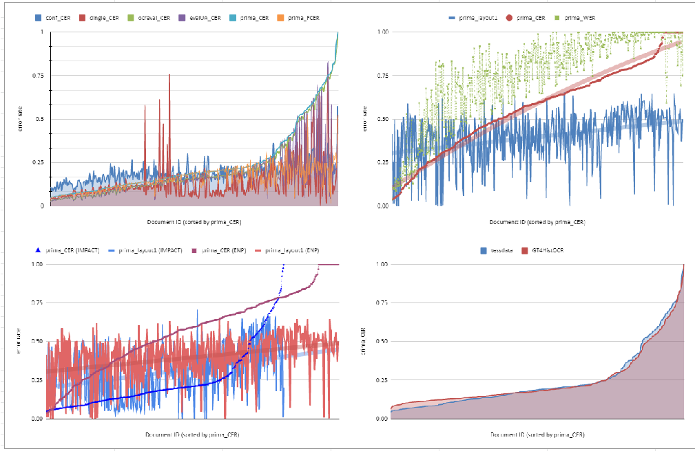
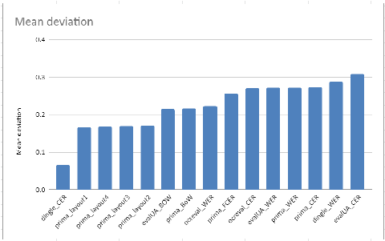

# A survey of OCR evaluation tools and metrics

Clemens Neudecker Konstantin Baierer Mike Gerber

www.staatsbibliothek-berlin.de Staatsbibliothek zu Berlin - Preußischer Kulturbesitz Berlin, Germany

Christian Clausner Apostolos Antonacopoulos Stefan Pletschacher

www.primaresearch.org Pattern Recognition and Image Analysis Lab (PRImA) University of Salford Greater Manchester, United Kingdom

## ABSTRACT

The millions of pages of historical documents that are digitized in libraries are increasingly used in contexts that have more specific requirements for OCR quality than keyword search. How to comprehensively, efficiently and reliably assess the quality of OCR results against the background of mass digitization, when ground truth can only ever be produced for very small numbers? Due to gaps in specifications, results from OCR evaluation tools can return different results, and due to differences in implementation, even commonly used error rates are often not directly comparable. OCR evaluation metrics and sampling methods are also not sufficient where they do not take into account the accuracy of layout analysis, since for advanced use cases like Natural Language Processing or the Digital Humanities, accurate layout analysis and detection of the reading order are crucial. We provide an overview of OCR evaluation metrics and tools, describe two advanced use cases for OCR results, and perform an OCR evaluation experiment with multiple evaluation tools and different metrics for two distinct datasets. We analyze the differences and commonalities in light of the presented use cases and suggest areas for future work.

## CCS CONCEPTS

• Applied computing → Optical character recognition; Document analysis; Graphics recognition and interpretation; • Information systems → Digital libraries and archives.

## KEYWORDS

optical character recognition, evaluation, accuracy, metrics

ACM Reference Format:

Clemens Neudecker, Konstantin Baierer, Mike Gerber, Christian Clausner, Apostolos Antonacopoulos, and Stefan Pletschacher. 2021. A survey of OCR evaluation tools and metrics. In The 6th International Workshop on Historical Document Imaging and Processing (HIP ’21), September 5–6, 2021, Lausanne, Switzerland. ACM, New York, NY, USA, 6 pages. https://doi.org/10.1145/ 3476887.3476888

Permission to make digital or hard copies of all or part of this work for personal or classroom use is granted without fee provided that copies are not made or distributed for profit or commercial advantage and that copies bear this notice and the full citation on the first page. Copyrights for components of this work owned by others than ACM must be honored. Abstracting with credit is permitted. To copy otherwise, or republish, to post on servers or to redistribute to lists, requires prior specific permission and/or a fee. Request permissions from permissions@acm.org.

HIP’21, September 05–06, 2021, Lausanne, Switzerland © 2021 Association for Computing Machinery. ACM ISBN 978-1-4503-8690-6/21/09...$15.00 https://doi.org/10.1145/3476887.3476888

## 1 INTRODUCTION

The efficient, transparent and informative evaluation of the quality of the results of Optical Character Recognition (OCR) is challenging in multiple respects. Established methods require Ground Truth (GT) data to serve as a reference for the desired result quality. Against the background of mass digitization1, where millions of pages of documents are digitized and OCRed, this is neither feasible nor affordable. Especially in the context of historical documents, the creation of GT requires specialised skills and is far too timeconsuming to perform on a sufficiently large scale.

A further difficulty lies in the fact that standards or established conventions that provide clear and uniform guidelines for the creation of GT for historical documents are only partially available. There remain various un- or underspecified cases that can occur when assessing OCR quality. Examples include: ligatures that can be recognized either as individual codepoints or as a combination of codepoints, characters that cannot be represented by a single codepoint, the encoding of special characters2 that are not included in the Unicode standard and for which extensions such as MUFI3 other codepoints from the Private Use Area4 must be used, and the treatment of punctuation and spaces. The OCR-D Ground Truth Guidelines [3] are an attempt to mediate between the OCR community and the needs of (scholarly) users of OCR results and to establish according specifications and guidelines.

In summary, established procedures and metrics for GT-based quality assessment of OCR results do not provide satisfactory answers when it comes to some of the more detailed questions that arise for historical documents. In addition, the extensive GT-based evaluation of large collections as are OCRed in the context of mass digitization is not feasible. The question to which extent OCRconfidence values and sample-based statistical evaluations can provide meaningful, reliable and comparable statements needs to be more systematically investigated. Finally, the quality of layout analysis seems to be insufficiently covered by established metrics.

This paper aims to raise and discuss issues of transparency and better direct comparability of OCR evaluation by identifying gaps and ambiguities in current methods and by putting the meaningfulness of OCR evaluation results more into the context of actual use cases for OCR results. The observations and analysis are drawn from

- 1Google estimated in 2010 that there are around 130M unique books published (cf. http://booksearch.blogspot.com/2010/08/books-of-world-stand-up-and-becounted.html) and digitized 40M in October 2019: https://www.blog.google/products/ search/15-years-google-books/.
- 2https://ocr-d.de/en/gt-guidelines/trans/ocr_d_koordinationsgremium_codierung. html. 3Medieval Unicode Font Initiative. https://folk.uib.no/hnooh/mufi/. 4Unicode Standard, Chapter 16: Special Areas and Format Characters.

the authors’ experience of working with very large and significant collections and interacting with scholars in the domains discussed. It is hoped that this study will lead to the development and adoption of more appropriate and useful evaluation methodologies.

The paper is structured as follows: Section 2 briefly discusses two use cases for OCR. Section 3 gives an overview of the stateof-the-art and common software tools for OCR evaluation. It also discusses alternative approaches to OCR evaluation. In section 4, an OCR evaluation experiment is presented where five common OCR evaluation tools are applied in the OCR evaluation of two datasets and the results are compared and discussed. To the best of the authors’ knowledge this is the first such experiment to methodically compare evaluation results. Section 5 concludes the paper with a summary and suggestions for future work.

## 2 USE CASES

With the wider availability of digitized documents, the usage of OCR results in digital libraries has shifted from simple indexing and keyword search to supporting more advanced use cases such as Natural Language Processing (NLP) or Text and Data Mining (TDM). Digital Humanities (DH) scholars now also have great interest in the computational analysis and study of digitized historical documents.

## 2.1 Natural Language Processing

An early study of the impact of OCR errors on downstream tasks in NLP is [18], where problematic cascading effects of errors throughout the stages of a NLP pipeline are observed. Named Entity Recognition (NER), the automatic recognition of proper names in texts, is a classic use case of NLP and a key technology for accessing the content of digital library collections. Search terms of user queries often include names of persons or places as well as dates [9], but so far, the enrichment of OCR results in digital libraries with NER is still rarely done on a production scale. The reason for this is that the success rate is usually considered too low based on already unsatisfactory OCR results [14]. For the accuracy of NER, the OCR quality of the texts plays a decisive role. [11] created a dataset for NER and integrated different classes of OCR errors into it. They observed a drop in accuracy of the NER from 90% to 60% when the word error rate was increased from 1% to 7% and the character error rate was increased from 8% to 20%, respectively. An evaluation of the submitted systems of the Shared Task HIPE came to similar results regarding the dependency of NER results and OCR quality for historical texts [10]. In addition to recognizing named entities, linking them to knowledge bases (named entity linking, NEL) can be used to disambiguate ambiguous proper names. Here, OCR quality plays a significant role as well [22]. Good OCR quality is also crucial for other NLP tasks [19], [37].

## 2.2 Digital Humanities

DH scholars apply computational tools and methods for research purposes in the humanities and cultural studies. DH can benefit from digitized historical documents because they are more readily available and quantitative methods can be applied to the texts to address research questions. However, to prevent OCR errors from skewing results, researchers depend on high quality digitized texts where errors can be transparently tracked. A qualitative study

conducted with historians shows that this is a major problem in practice [35]. Three of four respondents said they did not publish their quantitative studies based on digitized documents because they were potentially untrustworthy and the results could be challenged. In a quantitative study by [12], while OCR quality did not affect topic modeling as significantly, it did affect other statistical techniques typically used in DH such as collocation analysis and stylometry (especially when OCR accuracy was below 70%-75%). [30] collected the requirements for digitized full texts from the perspective of DH and formulated a research agenda for historical OCR, including a recommendation that is addressed directly to researchers in computer vision: “Formulate standards for annotation and evaluation of document layout”.

## 3 OCR EVALUATION: METHODS AND METRICS

A wide variety of metrics are available in the form of scientific papers and, in some cases, also as open implementations, but they only ever provide a partial perspective on the quality of OCR. In this section, the most prominent and commonly used metrics and tools are discussed.

## 3.1 State-of-the-art

Current methods for determining the quality of text recognition systems which are the most widely used in the scientific community (IAPR-TC11: Reading Systems) go back to the doctoral thesis of Stephen V. Rice [25]. Here the determination of the OCR quality is understood as a manipulation of character strings, which are transformed by an edit distance algorithm. For efficiency reasons, Rice recommends Ukkonen’s algorithm [36], a version of the Levenshtein distance [17] optimized for long strings, for evaluation of OCR. Rice further distinguishes Character Accuracy and Word Accuracy, and considers special cases such as Non-Stopword Accuracy or Phrase Accuracy (accuracy over a sequence of k words). For the OCR evaluations held by the Information Science Research Institute (ISRI) of the University of Nevada, Las Vegas between 1992-1996, the methods from Rice were implemented in the ISRI Evaluation Tools5 [26], which have since become the standard tool for measuring the quality of OCR in scientific articles and competitions. Between 2015 and 2016, the ISRI Evaluation Tools were updated with support for the Unicode character set [28].

Frequently, not the character accuracy, but the Character Error Rate (CER) is used. CER is the inverted accuracy, and defined as CER = (i + s + d) / n, where n is the total number of characters, i the minimal number of character insertions, s the substitutions and d the deletions required to transform the reference text into the OCR output.6 [16] propose an “end-to-end measure” which is based on the CER, but with alignment between GT and OCR results in a way that makes it configurable whether differences in the reading order or the over-/under-segmentation of text lines are penalized.

Major contributions to the evaluation of OCR have been made by the PRImA (Pattern Recognition & Image Analysis Research Lab) research group at the University of Salford, UK. At an early stage, several standards for the labeling and evaluation of OCR

- 5https://code.google.com/archive/p/isri-ocr-evaluation-tools/.
- 6https://sites.google.com/site/textdigitisation/qualitymeasures/computingerrorrates.

data were developed there. The PAGE (Page Analysis and GroundTruth Elements) format [21] is an XML-based standard for GT that can capture granular information for image features as well as for the structure of the layout and reading order. PRImA developed tools7 for objective evaluation of document analysis and recognition, among others for layout analysis [5] and the evaluation of the reading order [6] as well as a Flexible Character Accuracy (FCA) if the reading order is not correctly recognized [8].

A common strategy to gain insight into the quality of OCR but reduce the amount of GT required for evaluation is to apply (random) sampling. When selecting samples, particular care should be taken to apply procedures that achieve a reasonable degree of representativeness when determining OCR quality statistically, e.g. in a Bernoulli Experiment [38]. An advantage of this method is that the calculation based on randomized samples allows a statistically reliable statement, which would not be given by a manual selection of test pages. A significant implicit disadvantage is that the manual checking of individual characters and thus the manual search for text correspondences in the original mostly disregards the quality of layout analysis. Thus, in the end OCR quality is determined without considering the reading order. On the other hand, a randomized sample can also be disadvantageous since not every aspect of a document is equally important: within a newspaper, an incorrect heading of an article may have more adverse impact to further analysis than an error in an advertisement.

Systematic studies of OCR quality in the context of mass digitization are presented by [34] and [13]. [34] examined the OCR quality of the digitized newspaper archive of the British Library with regard to CER and WER and propose a significant-word-accuracy-rate, which only considers how many significant words are among the incorrectly recognized words, i.e. words that are relevant for capturing the document content. [13] presents a study of the most important factors influencing OCR quality for the Australian Newspaper Digitisation Program. The study gives recommendations on ways for OCR improvement, e.g. by integrating lexicons. However, the effectiveness of frequency-based language models in OCR is limited [31] and in the case of historical language, suitable language resources are sparse.

The IMPACT project [2] produced multiple tools for OCR evaluation in the context of historical document digitisation. The NCSR Evaluation Tool8 is based on the ISRI Evaluation Tools and extends them to support UTF-8, UTF-16 and the Figure of Merit. Figure of Merit is a metric that aims to quantify the effort required for manual post-correction of OCR [15]. For this purpose, substitutions are weighted 5 times higher than deletions, since they are correspondingly more difficult to detect and correct. Furthermore, the tool ocrevalUAtion9 was developed for comparison between GT and OCR results as well as between different OCR results in most common formats. It computes CER/WER according to Rice’s method, as well as unordered WER. The Qurator project [24] created the tool dinglehopper10 that can be used for transparent GT-based evaluation of OCR quality using CER/WER. It offers a visualization of incorrectly recognized characters in a side-by-side comparison of

- 7https://www.primaresearch.org/tools/PerformanceEvaluation.
- 8https://users.iit.demokritos.gr/~bgat/OCREval/.
- 9https://github.com/impactcentre/ocrevalUAtion.
- 10https://github.com/qurator-spk/dinglehopper.

GT and OCR results for manual inspection of OCR errors, so that problems in layout analysis or even GT can be easily identified.

## 3.2 Alternative Approaches

[1] developed a GT-free heuristic to determine the OCR quality of 19th century English business literature based on the relative frequency of numbers and words in a lexicon. For this purpose, they proposed a simple quality (SQ) score, which is calculated from the ratio of "good" words (words that occur in a dictionary) to all words. One problem with this approach in the context of historical documents is that there are few suitable historical dictionaries available that would allow valid historical spellings correctly recognized in the course of OCR to be placed in the category of "good" words.

An approach for GT-free evaluation from image pre-processing is that of [29], who use machine learning to derive models from a small set of GT (image and evaluation), which can then be transferred to new data. This is applied for OCR quality assessment by [7], who evaluated different classifiers for predicting the expected OCR quality based on small amounts of GT and achieved a mean error of prediction compared to GT between 2.6% and 11%.

[32] propose two metrics for GT-free OCR evaluation: they consider confidence values of the OCR algorithm under a Student’s t-distribution, and lexicality using document-specific language profiles such as those by [23], which also take into account historical spelling variants. They show a strong correlation between the distribution of spelling variants and OCR errors and demonstrate how the profiles can improve OCR post-correction. [27] compare OCR quality using cross-alignment with a second OCR for reference and find that they can predict OCR quality more faithfully using that method than the confidence scores produced by the OCR engine.

To summarize, while alternatives to GT-based OCR evaluation exist, they mostly require some alternative (e.g. language) resource, which may itself be sparse in the historical context. Furthermore, none of the approaches discussed can capture layout analysis performance to the extent required by the use cases presented in section 2. Accordingly, while alternative approaches may be well-suited for the particular contexts in which they were created, they can not alleviate the challenges and needs set out in sections 1 and 2.

4 EXPERIMENT

We conduct an experiment to determine if and where common methods and metrics for OCR evaluation differ or coincide in their assessment of OCR results for diverse historical documents on the basis of two distinct datasets. Five OCR evaluation tools discussed in section 3 are included in this comparison: from the PRImA group, we used both the TextEval and LayoutEvaluation software, where LayoutEvaluation is currently the only software we tested that comprehensively captures layout analysis performance, dinglehopper from the Qurator project, IMPACT’s ocrevalUAtion and the current implementation of the ISRI tools, ocreval. We also publish the source code to replicate our results.11

## 4.1 Datasets

For the experiment, we use two datasets: the first set contains historical book pages from the IMPACT Dataset [20] while the second

11https://github.com/cneud/hip21_ocrevaluation.

set contains digitized historical newspapers from the Europeana Newspapers Project (ENP) Dataset [4]. Both datasets contain mixed fonts, with a majority being in Fraktur. It should be noted that the IMPACT and ENP datasets are of unique significance as they have been designed to be representative both of the issues present in the collections of the most prominent European libraries and of the digitization priorities of those libraries.

OCR results for both datasets were produced with the OCR software Tesseract12, version 4.1.0, in two runs: once using a specific model for historical fonts trained on the GT4HistOCR dataset [33] for all pages irrespective of language, and, in a second run, with language models from tessdata13. In both cases, ALTO14 was used as the OCR output format. Additionally, the OCR confidence scores for each page were extracted for comparison.

## 4.2 Results

The ALTO OCR results were directly evaluated using the PAGE GT with the tools TextEval, LayoutEvaluation, dinglehopper and ocrevalUAtion, which all support both formats. For ocreval, the PAGE GT and the ALTO OCR need to be transformed into a UTF-8 plain text file, which can introduce a source of error in the OCR evaluation, e.g. when the reading order is ignored. For the LayoutEvaluation, a binarized image is required as an additional input. All evaluations except LayoutEvaluation were carried out on a Ubuntu Linux machine with a 4-core CPU and 64 GiB of RAM. LayoutEvaluation is a Windows-only program and was run on a 4-core machine with 16 GiB of RAM. While the evaluation of the IMPACT dataset was completed within a few hours, the evaluation of the ENP newspaper data took several days, and various evaluation tools (TextEval, dinglehopper, ocreval) crashed with out-of-memory exceptions on CER calculation for pages exceeding 60k characters. Generally, computation of CER can take hours for pages with >20k characters, which is the case for 140 of the 465 in the ENP dataset. On the contrary, none of the documents in the IMPACT dataset exceeds the amount of 2,609 characters per page. This has implications on performance evaluation in mass digitization of especially historical newspapers, and informed judgements must be made possible about when it is worth it or required to run more expensive metrics.

We provide the full results15 of evaluation runs with five tools for the OCR results with the models GT4HistOCR and tessdata each for 378 IMPACT pages and 465 ENP pages. For comparison, success rates and OCR confidence scores were inverted to error rates. Where evaluation tools reported error rates greater than 100%, these were clipped to 1.

Figure 1 displays four plots that provide different angles at the evaluation results. In the top left chart, we see the inverse confidence and CER metrics for the ENP dataset processed with tessdata models. OCR confidence has at best a slight correlation with CER in the low range but is otherwise not indicative of accuracy. CER roughly follows a common trend, with dinglehopper varying slightly because of different alignment and normalizations, and FCER being more optimistic than the other CER values because of its resistance

- 12https://github.com/tesseract-ocr/tesseract.
- 13https://github.com/tesseract-ocr/tessdata.
- 14https://www.loc.gov/standards/alto/.
- 15https://github.com/cneud/hip21_ocrevaluation.

to segmentation errors. Generally there is considerable heterogeneity observed between the reported CER scores though.

In the top right, we see CER, WER and LayoutEval metrics plotted for the ENP dataset processed with tessdata models. WER is expectedly larger than CER throughout and there is an apparent relation between CER and layout success rate.

In the bottom left, one can observe the CER and layout success rate for both ENP and IMPACT datasets. Two data points where removed due to errors in the processing. It becomes again clear that there is a correlation between text and layout success rate. The graph is sorted by the ascending CER for both datasets, and the layout success does have a correspondence with it, while the lines for layout quality for ENP and IMPACT datasets also indicate the presence of segmentation errors for both datasets that are not equally well captured by the CER.

In the bottom right, we show the calculated mean standard deviation for the various metrics that were evaluated.

In figure 2, we see the mean deviation of the various error rates we evaluated. We see that CER produced by dinglehopper has the least variance, followed by the four PRImA LayoutEval measures. On the opposite side, ocrevalUAtion’s CER has the highest variance, even more so than the various WER measures where we expect a higher variance, since they are based on the CER measures.

Due to time and space constraints, we are not able to dive further into the details of the evaluation results here. We plan to do so in future work, and with the release of all evaluation experiment data, invite and encourage others to investigate the results more closely.

## 5 CONCLUSION

Looking back, it becomes clear that multiple dimensions must be taken into account when evaluating OCR quality. Within the context of mass-digitization, the creation of GT for every page is far too costly and labour-intensive. But the confidence scores of the OCR engines must be looked at with caution. While alternative and GT-free approaches to OCR evaluation exist, they often rely on the availability of other suitable (e.g. language) resources. However, where such language resources are unavailable or not tailored to the requirements of historical documents, the aptitude of such methods for OCR evaluation remains limited. A technique to reduce the amount of GT for evaluation lies in quality assessment or even prediction techniques based on comparatively small but representative samples for which GT is needed.

Another main point of discussion is the comparability of OCR evaluation results. Based on the experiments carried out, we can establish that even “standardized” metrics such as CER/WER can not be compared directly between different implementations in evaluation tools. The main reasons are manifold: first, when the PAGE GT contains a defined reading order, but not all evaluation tools support it. Accordingly, the transformation of the PAGE GT to plain text can itself be a source of error, such as when the reading order is not taken into account during conversion. Secondly, TextEval, ocrevalUAtion and dinglehopper apply normalization for special Unicode codepoints occurring in historical texts, so for example, the recognition of decomposed ligatures is handled differently in different tools or even the same tool with a different configuration.

- Figure 1: Plots for various OCR evaluation experiment outputs (top left: comparison of CER metrics for IMPACT dataset processed with tessdata models; top right: CER/WER/LayoutEvaluation metrics for the ENP dataset processed with tessdata models; bottom left: CER/LayoutEvaluation metrics for both IMPACT and ENP processed with tessdata models; bottom right: CER for ENP processed with tessdata models vs GT4HistOCR model (all charts plot documents sorted by PRImA CER); TODO: mean deviation of all evaluation measures across all datasets

- Figure 2: Mean deviation of all evaluation measures across all datasets

Quality requirements for OCR results vary greatly depending on the intended use. While the quality of layout analysis is of little importance for keyword search, it is often crucial for digital scholarship or linguistic analysis of OCR results. Evaluation tools provide different perspectives and only partial statements about all relevant aspects of OCR quality. A solution can be the definition of standard evaluation profiles for particular use cases.

The importance of the layout analysis for the OCR results is not sufficiently considered by most metrics, and suitable concepts and standards that capture the quality of layout analysis in a uniform way have not yet been systematically adopted. A main barrier for this is the complex examination of the multi-layered quality aspects and use cases. For documents with challenging layout and advanced use cases that rely on the correct reading order, the meaningfulness of metrics that do not comprehensively capture the quality of layout analysis must be considered insufficient.

Digitization managers and DH scholars require clear OCR evaluation standards that are sufficiently uniform to be comparable but also comprehensive enough to allow adequate assessments

of OCR and layout analysis quality with a view on advanced use cases. What can we do to improve this situation? As a community, we should try to align the different implementations better, and agree on text normalization and alignment standards and possibly a common exchange format. Another important aspect is data provenance, i.e. keeping track of transformations and evaluation settings and providing this as contextual metadata with the evaluation. Finally, standard documents and open datasets for testing evaluation methods with predefined errors can help users to get a better understanding of the various quality aspects involved.

## ACKNOWLEDGMENTS

This work was partially supported by the German Research Foundation (DFG), project grant OCR-D, grant no. 409784275, and by the Federal German Ministry of Education and Research (BMBF), project grant QURATOR, grant no. 03WKDA1A.

## REFERENCES

- [1] Beatrice Alex and John Burns. 2014. Estimating and rating the quality of optically character recognised text. In Proceedings of the First International Conference on Digital Access to Textual Cultural Heritage. ACM, NY, USA, 97–102.
- [2] Hildelies Balk and Aly Conteh. 2011. IMPACT: centre of competence in text digitisation. In Proceedings of the 2011 Workshop on Historical Document Imaging and Processing. ACM, NY, USA, 155–160.
- [3] Matthias Boenig, Konstantin Baierer, Volker Hartmann, Maria Federbusch, and Clemens Neudecker. 2019. Labelling OCR Ground Truth for Usage in Repositories. In Proceedings of the Third International Conference on Digital Access to Textual Cultural Heritage. ACM, NY, USA, 3–8.
- [4] Christian Clausner, Christos Papadopoulos, Stefan Pletschacher, and Apostolos Antonacopoulos. 2015. The ENP image and ground truth dataset of historical newspapers. In 2015 13th International Conference on Document Analysis and Recognition (ICDAR). IEEE, NY, USA, 931–935.
- [5] Christian Clausner, Stefan Pletschacher, and Apostolos Antonacopoulos. 2011. Scenario driven in-depth performance evaluation of document layout analysis methods. In 2011 International Conference on Document Analysis and Recognition. IEEE, NY, USA, 1404–1408.
- [6] Christian Clausner, Stefan Pletschacher, and Apostolos Antonacopoulos. 2013. The significance of reading order in document recognition and its evaluation. In 2013 12th International Conference on Document Analysis and Recognition. IEEE, NY, USA, 688–692.
- [7] Christian Clausner, Stefan Pletschacher, and Apostolos Antonacopoulos. 2016. Quality prediction system for large-scale digitisation workflows. In 2016 12th IAPR Workshop on Document Analysis Systems (DAS). IEEE, NY, USA, 138–143.
- [8] Christian Clausner, Stefan Pletschacher, and Apostolos Antonacopoulos. 2020. Flexible character accuracy measure for reading-order-independent evaluation. Pattern Recognition Letters 131 (2020), 390–397.
- [9] Gregory Crane and Alison Jones. 2006. The challenge of virginia banks: an evaluation of named entity analysis in a 19th-century newspaper collection. In Proceedings of the 6th ACM/IEEE-CS joint conference on Digital libraries. IEEE, NY, USA, 31–40.
- [10] Maud Ehrmann, Matteo Romanello, Alex Flückiger, and Simon Clematide. 2020. Extended overview of CLEF HIPE 2020: named entity processing on historical newspapers. In CLEF 2020 Working Notes. Conference and Labs of the Evaluation Forum, Vol. 2696. CEUR, Aachen, Germany, 1–38.
- [11] Ahmed Hamdi, Axel Jean-Caurant, Nicolas Sidere, Mickaël Coustaty, and Antoine Doucet. 2019. An analysis of the performance of named entity recognition over OCRed documents. In 2019 ACM/IEEE Joint Conference on Digital Libraries (JCDL). IEEE, NY, USA, 333–334.
- [12] Mark J Hill and Simon Hengchen. 2019. Quantifying the impact of dirty OCR on historical text analysis: Eighteenth Century Collections Online as a case study. Digital Scholarship in the Humanities 34, 4 (2019), 825–843.
- [13] Rose Holley. 2009. How good can it get? Analysing and improving OCR accuracy in large scale historic newspaper digitisation programs. D-Lib Magazine 15, 3/4

(2009), Unpaginated.

- [14] Kimmo Kettunen, Eetu Mäkelä, Teemu Ruokolainen, Juha Kuokkala, and Laura Löfberg. 2017. Old content and modern tools-searching named entities in a Finnish OCRed historical newspaper collection 1771-1910. Digital Humanities Quarterly 11 (2017), 24. Issue 3.
- [15] Vladimir Kluzner, Asaf Tzadok, Yuval Shimony, Eugene Walach, and Apostolos Antonacopoulos. 2009. Word-based adaptive OCR for historical books. In 2009

- 10th International Conference on Document Analysis and Recognition. IEEE, NY, USA, 501–505.
- [16] Gundram Leifert, Roger Labahn, Tobias Grüning, and Svenja Leifert. 2019. End-ToEnd Measure for Text Recognition. In 2019 International Conference on Document Analysis and Recognition (ICDAR). IEEE, NY, USA, 1424–1431.
- [17] Vladimir I Levenshtein. 1966. Binary codes capable of correcting deletions, insertions, and reversals. Soviet physics doklady 10, 8 (1966), 707–710.
- [18] Daniel Lopresti. 2009. Optical character recognition errors and their effects on natural language processing. International Journal on Document Analysis and Recognition (IJDAR) 12, 3 (2009), 141–151.
- [19] Margot Mieskes and Stefan Schmunk. 2019. OCR Quality and NLP Preprocessing. In Proceedings of the 55th Annual Meeting of the Association for Computational Linguistics, Florence, Italy. ACL, Stroudsburg PA, USA, 102–105.
- [20] Christos Papadopoulos, Stefan Pletschacher, Christian Clausner, and Apostolos Antonacopoulos. 2013. The IMPACT dataset of historical document images. In Proceedings of the 2Nd international workshop on historical document imaging and processing. ACM, NY, USA, 123–130.
- [21] Stefan Pletschacher and Apostolos Antonacopoulos. 2010. The page (page analysis and ground-truth elements) format framework. In 2010 20th International Conference on Pattern Recognition. IEEE, NY, USA, 257–260.
- [22] Elvys Linhares Pontes, Ahmed Hamdi, Nicolas Sidere, and Antoine Doucet. 2019. Impact of OCR quality on named entity linking. In International Conference on Asian Digital Libraries. Springer, NY, USA, 102–115.
- [23] Ulrich Reffle and Christoph Ringlstetter. 2013. Unsupervised profiling of OCRed historical documents. Pattern Recognition 46, 5 (2013), 1346–1357.
- [24] Georg Rehm, Peter Bourgonje, Stefanie Hegele, Florian Kintzel, Julián Moreno Schneider, Malte Ostendorff, Karolina Zaczynska, Armin Berger, Stefan Grill, and Sören et al. Räuchle. 2020. QURATOR: Innovative Technologies for Content and Data Curation. CEUR-WS 2535, 1 (2020), 15.
- [25] Stephen Vincent Rice. 1996. Measuring the accuracy of page-reading systems. UNLV, Las Vega, NV.
- [26] Stephen V Rice and Thomas A Nartker. 1996. The ISRI analytic tools for OCR evaluation. UNLV/Information Science Research Institute, TR-96 2 (1996), 45.
- [27] Ahmed Ben Salah, Jean Philippe Moreux, Nicolas Ragot, and Thierry Paquet.

2015. OCR performance prediction using cross-OCR alignment. In Proceedings of the 13th International Conference on Document Analysis and Recognition (ICDAR). IEEE, NY, USA, 556–560.

- [28] Eddie A Santos. 2019. OCR evaluation tools for the 21st century. In Proceedings of the Workshop on Computational Methods for Endangered Languages, Vol. 1. ACL, Stroudsburg PA, USA, 23—-27.
- [29] Prashant Singh, Ekta Vats, and Anders Hast. 2018. Learning surrogate models of document image quality metrics for automated document image processing. In 2018 13th IAPR International Workshop on Document Analysis Systems (DAS). IEEE, NY, USA, 67–72.
- [30] David A Smith and Ryan Cordell. 2018. A research agenda for historical and multilingual optical character recognition. Northeastern University, Boston, MA.
- [31] Ray Smith. 2011. Limits on the application of frequency-based language models to OCR. In 2011 International Conference on Document Analysis and Recognition. IEEE, NY, USA, 538–542.
- [32] Uwe Springmann, Florian Fink, and Klaus U Schulz. 2016. Automatic quality evaluation and (semi-) automatic improvement of OCR models for historical printings. arXiv preprint arXiv:1606.05157 (2016), 8.
- [33] Uwe Springmann, Christian Reul, Stefanie Dipper, and Johannes Baiter. 2018. Ground Truth for training OCR engines on historical documents in German Fraktur and Early Modern Latin. arXiv preprint arXiv:1809.05501 (2018), 8.
- [34] Simon Tanner, Trevor Muñoz, and Pich Hemy Ros. 2009. Measuring mass text digitization quality and usefulness. D-lib Magazine 15, 7/8 (2009), 1082–9873.
- [35] Myriam C Traub, Jacco Van Ossenbruggen, and Lynda Hardman. 2015. Impact analysis of OCR quality on research tasks in digital archives. In International Conference on Theory and Practice of Digital Libraries. Springer, NY, USA, 252–263.
- [36] Esko Ukkonen. 1995. On-line construction of suffix trees. Algorithmica 14, 3

(1995), 249–260.

- [37] Daniel van Strien, Kaspar Beelen, Mariona Coll Ardanuy, Kasra Hosseini, Barbara McGillivray, and Giovanni Colavizza. 2020. Assessing the Impact of OCR Quality on Downstream NLP Tasks. In ICAART (1). SCITEPRESS, Setúbal, Portugal, 484– 496.
- [38] Maria Wernersson. 2015. Evaluation von automatisch erzeugten OCR-Daten am Beispiel der Allgemeinen Zeitung. ABI Technik 35, 1 (2015), 23–35.

