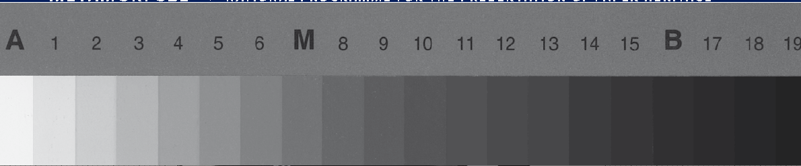
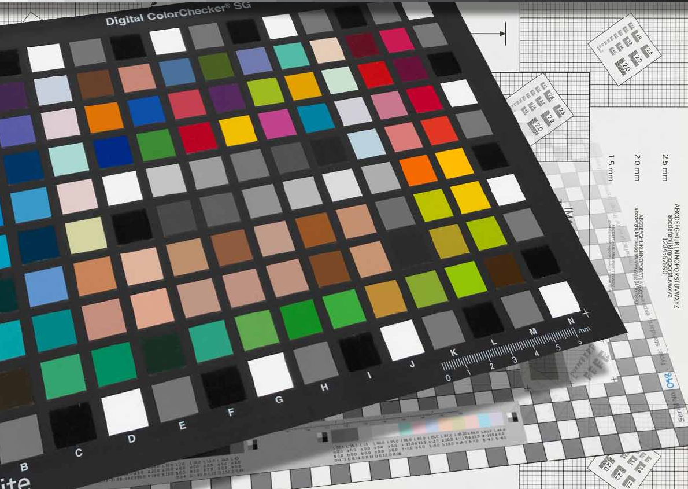
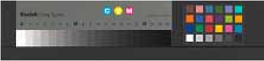
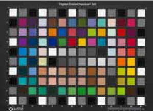
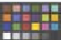
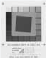
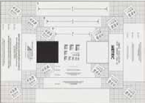
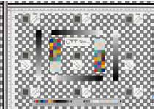
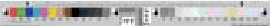
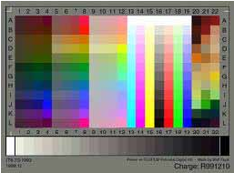

Metamorfoze Preservation Imaging Guidelines | Image Quality, Version 1.0, January 2012 | 1

# Metamorfoze Preservation Imaging Guidelines

Image Quality, version 1.0, January 2012

Hans van Dormolen

metamorfoze R national programme for the preservation of paper heritage

Richtlijnen Preservation Imaging Metamorfoze | januari 2012 | 2

# Metamorfoze Preservation Imaging Guidelines

Image Quality, version 1.0, January 2012

Hans van Dormolen

National Library of the Netherlands (KB) The Hague (NL)

Acknowledgements: Dietmar Wueller, Uwe Artmann, Volker Jansen, Jasper den Hollander, Joop Korswagen, Tobias Beck, Mirjam Raaphorst, Miluska Dorgelo, Johan van der Knijff, Robert Gillesse, Alexandra Daniëls, Foekje Boersma, Cecile van der Harten, Mariëlle Gerritsen, Maurice Tromp, Marianne Peereboom, Thijs Quispel, Anco Jansen, Henni van Beek, Matina Hoffmann, Jeroen Poppe, Astrid Verheusen, Huibert Crijns, Andrea Langendoen, Dennis Schouten, , Henriëtte Reerink, Martijn Peters, Barbara Sierman, Carlijn Agterberg, Reinier Deinum, Barbara de Goederen, Marian Hellema, Don Williams, Peter Burns, Michael Stelmach, Torsten Kupke, Martin van der Veen, Philippe Bayle, Cedric Muscat, Ronnie Mampaey, Daniel Johnston.

Many thanks to all the companies and organizations that have helped us develop and distribute these guidelines, including: Nationaal Arhief, Van Gogh Museum, Rijksmuseum Amsterdam, Metropolitan New York, Stadsarchief Amsterdam, Studio Buitenhof, Karmac, MicroFormat, Pictura, GMS, Wennekes Fotografie and Acmis.

Our special thanks go to Scott Geffert who played a key role in the developing process and international adoption of the Metamorfoze Guidelines.

©Hans van Dormolen/Koninklijke Bibliotheek 2012.

This work is licensed under a Creative Commons Attribution-NoDerivs 3.0 Unported (CC BY-ND 3.0) license (http://creativecommons.org/licenses/by-nd/3.0). This means that the copyright of this article rests with Hans van Dormolen and the National Library of the Netherlands (Koninklijke Bibliotheek) and that you are free to use, copy, distribute and transmit the work in unaltered form, provided the following statement is included: ‘©Hans van Dormolen/Koninklijke Bibliotheek 2012’ and the above mentioned Creative Commons-license.

introduction 4

- chapter 1 technical image criteria 6

- 1.1 Three quality levels 7
- 1.2 Overview of the quality levels & tolerances 9
- 1.3 Metamorfoze exposure table for UTT & SRC neutrals 11
- 1.4 Metamorfoze exposure table for Kodak Gray Scale 12
- 1.5 Metamorfoze exposure table for Digital ColorChecker SG neutrals 13
- 1.6 Formulas and paper sizes 14

- chapter 2 clarification and additional comments 16

- 2.1 Reference file 16
- 2.2 Color space 17
- 2.3 Bit depth 17
- 2.4 White balance & tonal capture 18
- 2.5 Exposure 19
- 2.6 Gain modulation 19
- 2.7 Noise 21
- 2.8 Illumination 21
- 2.9 Color cast 22
- 2.10 Color accuracy 23
- 2.11 Color accuracy & Metamarism 23
- 2.12 MTF measurement 24
- 2.13 Sampling Rate 24
- 2.14 Claimed Sampling Rate 25
- 2.15 Obtained Sampling Rate 25
- 2.16 MTF10 25
- 2.17 Theoretical Resolution & Sampling Efficiency 25
- 2.18 MTF50 26
- 2.19 Sharpening 26
- 2.20 Color misregistration 27
- 2.21 Geometric distortion 27
- 2.22 Artifacts 37
- 2.23 Other deviations 38

- chapter 3 technical targets 29

- 3.1 Day targets, sampling rate, black background, order & image composition 29
- 3.2 Technical targets in every individual image 31
- 3.3 Images of technical targets 32

- chapter 4 capturing method 34

- 4.1 Cropping 34
- 4.2 Rotate and straighten 34
- 4.3 Technical metadata and Technical Image Control 34

- appendix 1: metamorfoze guidelines and the future 36 Universal Test Target (UTT) and the Scan Reference Chart (SRC) 36 Color accuracy 36 From three color channels to one gray scale channel 37
- appendix 2: metamorfoze additional exposure tables 38

### references 43 quotation of sources 44

## introduction

Metamorfoze Metamorfoze, the national program for preserving the paper heritage, is a joint venture between the National Library of the Netherlands (Koninklijke Bibliotheek or KB) and the National Archives. The program is the joint initiative of the Ministry of Education, Culture and Science and is being coordinated by Bureau Metamorfoze.

As of 2010 the program consists of two projects:

- - Archives and Special Collections, carried out in cooperation with the National Archives (NA).
- - Books, Newspapers and Magazines, carried out in cooperation with the National Library of the Netherlands.

Purpose of the guidelines The Metamorfoze Preservation Imaging Guidelines are input oriented and relate exclusively to the image quality and metadata of the first file. All the desired output (derivatives) intended for print and/or the Internet can be made from this first file. In these guidelines this first file is referred to as the Preservation Master.

The guidelines are intended for the digitalization of two-dimensional materials such as manuscripts, archives, books, newspapers and magazines. They may also be applied for digitalizing photographs, paintings and technical drawings.

These guidelines should be considered the image quality standard of Metamorfoze Preservation Imaging. This means that the guidelines apply to all the projects that are subsidized by Bureau Metamorfoze. The preservation masters provided in this context must be of such a quality and measurable relationship to the original, that they can in fact replace it. This means that all the information visible in the original must also be visible in the preservation master; the information transfer must be complete since the original is threatened by autonomous decay and will no longer be used once it has been digitized.

The guidelines mention the different technical criteria and tolerances. With these criteria and tolerances the technical quality of the preservation master can be assessed objectively. This objective assessment is carried out using the technical targets and software. In addition to the objective assessment method, a digital image must always be visually assessed for artifacts.

Universal Test Target (UTT), Scanner Reference Chart (SRC) and other technical test charts In order to analyze all the technical criteria referred to in these guidelines promptly and efficiently the technical test charts UTT and the SRC, as well as the UTT software have been developed. The first projects are being carried out using UTT ‘as we speak’.

These guidelines provide the technical tolerances in 8 bit pixel values and also in the Delta E, L and C values; which means these guidelines can be used with the UTT, the SRC and related software, and also with other test charts and software referred to in the previous versions of the Metamorfoze Guidelines.

Therefore, before launching new digitalization projects, the technical test charts and software to be used must be agreed on with Bureau Metamorfoze. This applies to all digitalization projects subsidized by Bureau Metamorfoze.

The Metamorfoze Guidelines attract much international attention, from the cultural and heritage sectors as well as the manufacturing industry (suppliers, manufacturers of cameras and scanners). The Metamorfoze Guidelines are used at an international level. To ensure these guidelines can be used as widely as possible, an appendix has been provided to give the Metamorfoze exposure tolerances for ProPhoto RGB and the technical targets that are developed in the United States, such as the Device Level Target (DLT) and the Object Level Target (OLT).

This new version of the Metamorfoze Preservation Imaging Guidelines follows the Dutch draft version dated April 2011 and the English version called Metamorfoze Preservation Imaging Guidelines, Test version 0.8, July 2010.

Comments to these guidelines The National Library of the Netherlands and Bureau Metamorfoze will gratefully receive any comments to this new version of the Guidelines. Please contact Hans van Dormolen, Imaging Specialist at the National Library of the Netherlands, The Hague, the Netherlands on 0031 70 3140129, or you may e-mail your message to hans.vandormolen@kb.nl.

## HOOFDSTUK1 1 technical image criteria

The quality of a digital image is determined by analyzing the technical image criteria. Because the latter influence each other, the order in which they are used is essential both in digitalizing and analyzing processes.

Below is a list of the technical image criteria in the order in which they are applied in the guidelines:

- 1 ColorspaceandBitdepth. Prior to the digitalizing process the destination color space must be determined. The 8 bit pixel values used to express the right exposure and contrast transfer may vary for each color space. Files delivered without the color space cannot be technically verified.
- 2 Whitebalance. To assess exposure, the OECF and color accuracy, proper neutral setting is required for the entire gray scale.
- 3 Exposure. Exposure is primarily evaluated in the high lights. Exposure in case of camera capture is set as hardware, with the right aperture and light settings.
- 4 GainModulation. If exposure meets the criteria set in these guidelines, then the gain modulation (contrast transfer) can be assessed.
- 5 Exposure&GainModulation. After assessing exposure and gain modulation properly in the high lights, the rest of the gray scale is ready for analysis. Also, illumination can only be assessed after assessing the gain modulation.

After assessing the tonal capture as described in the above, the following technical criteria are ready for assessment:

- 6 Standarddeviation,noise
- 7 Illumination
- 8 Colorcast
- 9 Coloraccuracy
- 10 Samplingrate.In the digitalization process, setting the right and desired sampling rate is the first step required. During the technical check the real sampling rate (obtained sampling rate) and the sampling rate referred to in the metadata (claimed sampling rate) are verified after assessing the color accuracy.
- 11 MTF10,SamplingEfficiency,MTF50,maximummodulation,colormisregistration
- 12 Geometricdistortion
- 13 Imageartifacts

Chapter 2 Clarification and Additional Comments discusses and explains all the above criteria.

- 1 The color accuracy tolerances are described in these guidelines using the technical test chart Digital ColorChecker SG. Color accuracy, metamarism and use of UTT are discussed in sections 2.8 Color Accuracy and 2.9 Color Accuracy & Metamarism.
- 2 Patch 19 of the UTT has an L* value of ≈ 5 (reflection density ≈ 2.26).
- 3 Patch E6 of the Digital ColorChecker SG has an L* value of ≈ 6.75 (reflection density ≈ 2.13).
- 4 The gain modulation tolerance is very strict in the high lights.

1.1 Three quality levels For every original the quality of the technical image criteria referred to in these guidelines is significant. The tolerance level of the individual criteria is determined by the classification of the originals into one of the quality levels described below. Also, the technical test charts are used differently for each quality level.

- 1 Metamorfoze
- 2 MetamorfozeLight
- 3 MetamorfozeExtraLight

- 1 Metamorfoze In this quality level of the guidelines the color accuracy tolerance1 has been described very strictly. This high digitalization quality level is intended for digitalizing originals that are considered works of art, such as letters with drawings by Vincent van Gogh or maps, photo collections and paintings. To reach this high color accuracy level the tonal capture (white balance, exposure and gain modulation) and noise must meet the guidelines referred to in this quality level to deep black. Deep black is taken to mean the black of patch 19 of the UTT2 gray scale and the black of patch E6 of the Digital ColorChecker SG3. The measured or real L*a*b* values of the technical targets may deviate from the theoretical values. Therefore it is more accurate to use technical test charts of which the L*a*b* values are known. On acquiring a mounted UTT an L*a*b* reference file is also supplied. This reference file states the L*a*b* values and color patches of the UTT. In the UTT software the white balance, exposure, gain modulation and color accuracy are assessed using this reference file. See Chapter 2 for more information. To use a UTT test chart in this quality level working with a mounted UTT and a reference file linked to this chart is obligatory. For digitalizing purposes in accordance with this quality level high end One-shot and Multi-shot systems are used in most cases such as Hasselblad, Leaf and Phase-One.
- 2 Metamorfoze Light In the second quality level of the guidelines the color accuracy tolerance is described less strictly. The second digitalization quality level is intended for digitalizing originals whereby color accuracy is slightly less significant. Examples include books, newspapers, magazines and hand-written material. A very small dynamic range is what typifies these originals. In general, the maximum density in these originals does not exceed a density of approximately 1.20 or 1.30. In this quality level the tonal capture (white balance, exposure and gain modulation) and noise are assessed to a density level slightly exceeding the expected density in the originals. The tonal capture and noise are assessed up to a density of 1.55 (patch 15 of the Q-13) or up to an L* value of 20 (patch 16 of the UTT. An L* value of 20 corresponds with a density value of 1.52).

Originals with a slightly bigger dynamic range and originals of which the maximum density value level is not quite certain must be digitized according to the first quality level of these guidelines. Because the Metamorfoze Guidelines primarily assume the exact exposure and the right contrast transfer in the high lights4, in the second quality level too the right paper hue of the original is ensured in the preservation master. Because the tonal capture is not assessed to deep black the color accuracy tolerance is set slightly more comfortably compared to the Metamorfoze quality level. To use a UTT test chart in this quality level a mounted UTT must be used as well as a reference file linked to this chart. For digitizing purposes according to Metamorfoze Light scanners are used in most cases. For this quality level high end digital single lens reflex cameras (DSLR cameras) may also be used.

3 Metamorfoze Extra Light The third quality level is intended exclusively for digitizing books, newspapers and magazines. For digitalization purposes according to this quality level, scanners are used in most cases. For the quality level too high end DSLR cameras may be used. In this quality level the same color accuracy tolerance applies as in the Metamorfoze Light quality level. Metamorfoze Extra Light differs from Metamorfoze Light as follows:

- - Thegainmodulationisassessedonlyinthehighlights.The gain modulation tolerance is described only in the high lights. This description ensures the right paper hue.
- - Optionaluseofthetechnicaltestchartspercapture.In the third quality level using the technical test charts in each capture is optional. Not using the technical test charts whenever originals are captured means that the technical inspection is mainly tuned to stabilizing the digitalizing equipment. A capture without the technical targets cannot be assessed technically. A visual check, tuned to the possible artifacts, can be performed.
- - Grayscalefilesareallowed.In this quality level and in deliberation with Bureau Metamorfoze, originals that do not contain color information may be digitized in gray scale. When digitizing in gray scale the technical criteria assessment related to color expires. The following technical criteria are involved: white balance, color cast, color misregistration and color accuracy.
- - UTT.To use a UTT test chart in this quality level Bureau Metamorfoze may grant permission for working with a UTT without using the reference file linked to the UTT. This means that the theoretical L*a*b* values are used for digitizing and the technical check. Also, and with the permission of Bureau Metamorfoze, a non-attached UTT can be used. This means that perhaps in the future technically high-quality throughput scanners can and may be used for Metamorfoze Extra Light.

Chapter 3, Technical Targets, discusses the use of technical targets in detail.

metamorfoze metamorfoze light metamorfoze extra light

- - High color accuracy - Good color accuracy - Good color accuracy

- - Files can be delivered in gray scale
- - Using technical test charts per capture is optional
- - Using the UTT reference file is optional
- - Using the non-mounted UTT is optional

Material Material Material

- - Works of art - Hand-written material - Books
- - Photos - Books - Newspapers
- - Newspapers - Magazines
- - Magazines

1.2 Overview of the quality levels & tolerances

##### metamorfoze

###### metamorfoze light

###### metamorfoze extra light



 UTT  referencefile

Obligatory

Obligatory

Optional

Obligatory eciRGBv2

UTTattached  Colorspace

Obligatory eciRGBv2 / Adobe RGB (1998) 8 bit UTTneutrals, patch 16, L* ≈ 20, (reflection density≈ 1.52) Q-13, patch 15, L* ≈ 19,31, (reflection density≈ 1.55) ΔC* ≤ 2 8 bit pixel value +3 and -3 ΔL* ≤ 2 ΔE* ≤ 2.83

Optional Adobe RGB (1998),Gray Gamma 2.2, eciRGBv2 8 bit UTTneutrals, patch 16, L* ≈ 20, (reflection density≈ 1.52) Q-13, patch 15, L* ≈ 19,31, (reflection density≈ 1.55) ΔC* ≤ 2

16 bit (8 bit) UTTneutrals, patch 19, L* ≈ 5, (reflection density≈ 2.26)

Bitdepth Assessingthewhitebalance, exposuretolerance,gain modulationandnoiseto L*values

######  DigitalColorCheckerSG,  patch E-6, L* ≈ 6,75,

(reflection density≈ 2.12) ΔC* ≤ 2

Whitebalance(color cast)

8 bit pixel value +3 and -3 ΔL* ≤ 2 ΔE* ≤ 2.83

8 bit pixel value +3 and -3 ΔL* ≤ 2 ΔE* ≤ 2.83

Exposuretolerances (see exposure tolerances with 8 bit pixel values on the next few pages) GainModulationinthehigh lights5

0.8 – 1.08 (80% - 108%) 0.60 – 1.40 (60% – 140%)

0.8 – 1.08 (80% - 108%) 0.60 – 1.40 (60% – 140%)

0.8 – 1.08 (80% - 108%) 0.10 – 2.00 (10% - 200%)

 OnlywithUTT:GainModulation followingthegrayscalethru theL*valueasshownper category

Noise(standard deviation). Noise is measured in Y Illumination DIN A4 thru DIN A3 Illumination > DIN A3 thru DIN A2

16 bit STD ≤ 1024 (8 bit STD ≤ 4)

STD ≤ 4

STD ≤ 4

- - ΔL* 3
- - eciRGBv2: PV 68
- - ΔL*4
- - eciRGBv2: PV 10

- - ΔL* 3
- - PV 78
- - ΔL*4
- - eciRGBv2: PV 10
- - Adobe RGB (1998): PV 12

- - ΔL* 3
- - PV 88
- - ΔL*4
- - eciRGBv2: PV 10
- - Adobe RGB (1998): PV 12

- 5 High lights = UTT neutrals: patch numbers 1-3, neutrals DCSG: patch E-5 and J-6, Kodak Gray Scale: patch A and 1.
- 6 PV stands for 8 bit pixel values.

- 7 This 8 bit pixel value applies to eciRGBv2 and Adobe RGB

(1998).

- 8 This 8 bit pixel value applies to Adobe RGB (1998), Gray Gamma 2.2 and eciRGBv2.

##### metamorfoze

###### metamorfoze extra light

###### metamorfoze light

  Illumination

- - ΔL* 5
- - eciRGBv2: PV 13
- - ΔL* 6
- - eciRGBv2: PV 16

- - ΔL* 5
- - eciRGBv2: PV 13
- - Adobe RGB (1998): PV 14
- - Gray Gamma 2.2: PV 14
- - ΔL* 6
- - eciRGBv2: PV16
- - Adobe RGB (1998): PV 18
- - Gray Gamma 2.2: PV 18 Mean ΔE* ≤ 5 Max ΔE* ≤18

- - ΔL* 5
- - eciRGBv2: PV 13
- - Adobe RGB (1998): PV 14
- - ΔL* 6
- - eciRGBv2: PV16
- - Adobe RGB (1998): PV 18

>DIN A2 t/m DIN A1

    Illumination

>DIN A1 t/m DIN A0

 Coloraccuracy9  cie 1976, Digital

Mean ΔE* ≤ 4 Max ΔE* ≤10

Mean ΔE* ≤ 5 Max ΔE* ≤ 18

ColorChecker SG  Requiredsamplingrate     

300ppi. This is for the originals ≥ DIN A5 t/m DIN A2 600ppi. This is for the originals <DIN A510 150ppi. This is for the originals >DIN A211 ≤ 2%

300ppi. This is for the originals ≥ DIN A5 thru DIN A2 600ppi. This is for the originals <DIN A510 150ppi. This is for the originals >DIN A2 ≤ 2%

 300ppi. This is for the originals ≥ DIN A5 t/m DIN A2 600ppi. This is for the originals <DIN A510 150ppi. This is for the originals >DIN A211 ≤ 2%

     Differencebetweenclaimed samplingrate&obtained samplingrate

≥ 85%

≥ 85%

≥ 85%

 SamplingEfficiency,horizontal andvertical MTF50,horizontalandvertical   Maximummodulation

≥ 45% of the minimum number of lp/mm being required MTF10 ≤ 1.05 ≤ 0.50 pixel

≥ 45% of the minimum number of lp/mm required at MTF10 ≤ 1.05 ≤ 0.50 pixel

≥ 50% of the minimum number of lp/mm being required at MTF10 ≤ 1.05 ≤ 0.35 pixel

 Colormisregistration12

percolorchannel  Geometricdistortion  Artifacts

≤ 2% None

≤ 2% None

≤ 2% None

12 The color registration tolerances do not apply to the gray scale files.

- 10 To digitalize with more than 300 ppi the permission of Bureau Metamorfoze is required.
- 11 To digitalize with less than 300 ppi the permission of Bureau Metamorfoze is required. This permission can only be granted provided hand-written material is not involved and provided the undercast ‘e’ in the originals is bigger than or as big as 2 mm.

9 These Guidelines describe the color accuracy tolerances with the technical test chart Digital ColorChecker SG. The formula used to determine the color accuracy and to describe the tolerances is CIE 1976. The white reference that must be used is the white of the ICC profile being used. The color accuracy tolerances do not apply to the grayscale files.

### 1.3 Metamorfoze exposure table for the UTT & SRC neutrals

Overview of the theoretical13L* values and theoretical 8 bit pixel values

patch l* 8 bit 8 bit patch l* 8 bit 8 bit pixel value pixel value pixel value pixel value ecirgbv2 adobe rgb ecirgbv2 adobe rgb

(1998)    (1998)

- 1 (SRC) 97 247 246 11 (SRC) 47 120 111 95 242 240 45 115 106 93 237 234 43 110 101
- 2 (SRC) 92 235 231 12 42 107 99 90 230 226 40 102 94 88 224 220 38 97 90
- 3 (SRC) 87 222 217 13 37 94 88 85 217 211 35 89 83 83 212 205 33 84 79
- 4 82 209 203 14 32 82 77 80 204 197 30 77 72 78 199 191 28 71 68
- 5 77 196 189 15 27 69 66 75 191 183 25 64 62 73 186 178 23 59 58
- 6 72 184 175 1614 (SRC) 22 56 56 70 179 170 20 51 52 68 173 164 18 46 48
- 7 67 171 162 17 17 43 46 65 166 156 15 38 42 63 161 151 13 33 39
- 8 62 158 148 18 (SRC) 12 31 37 60 153 143 10 26 33 58 148 138 8 20 30
- 9 (SRC) 57 145 136 1915 (SRC) 7 18 28 55 140 131 5 13 24 53 135 126 3 8 19
- 10 (SRC) 52 133 123 50 128 118 48 122 113

15 In the quality level Metamorfoze the white balance, exposure, gain modulation and noise are assessed up to and including patch 19.

14 In the quality levels Metamorfoze Light and Metamorfoze Extra Light the white balance, exposure, gain modulation (if applicable) and noise are assessed up to and including patch 16.

13 These theoretical L* values are used for producing the UTT neutrals. In practice the neutrals can have a slightly different L* a* b* value which is why departing from the real L*a*b* values is a more accurate method.

### 1.4 Metamorfoze exposure table for the Kodak Gray Scale

Overview of the theoretical16L* values and theoretical 8 bit pixel values

patch l*17 8 bit 8 bit patch l* 8 bit 8 bit pixel value pixel value pixel value pixel value ecirgbv2 adobe rgb ecirgbv2 adobe rgb

(1998)     (1998)

A 97.63 249 248 10 37.82 96 89 95.63 244 242 35.82 91 85 93.63 239 236 33.82 86 81

- 1 89.39 228 224 11 33.99 87 81 87.39 223 218 31.99 82 77 85.39 218 212 29.99 76 72
- 2 81.75 208 202 12 30.45 78 73 79.75 203 196 28.45 73 69 77.75 198 191 26.45 67 65
- 3 74.68 190 182 13 27.16 69 66 72.68 185 177 25.16 64 62 70.68 180 171 23.16 59 58
- 4 68.12 174 165 14 24.12 62 60 66.12 169 159 22.12 56 56 64.12 164 154 20.12 51 52
- 5 62.06 158 149 1518 21.31 54 54 60.06 153 143 19.31 49 50 58.06 148 138 17.31 44 47
- 6 56.55 144 134 16 18.70 48 49 54.55 139 129 16.70 43 45 52.55 134 124 14.70 37 42
- 7 51.24 131 121 17 16.28 42 45 49.24 126 116 14.28 36 41 47.24 120 111 12.28 31 37
- 8 46.42 118 110 18 14.04 36 40 44.42 113 105 12.04 31 37 42.42 108 100 10.04 26 33
- 9 41.95 107 99 1919 11.97 31 37 39.95 102 94 9.97 25 33 37.95 97 90 7.97 20 30

- 16 These L* values and the 8 bit pixel values are based on the theoretical reflection values of the neutrals. Theoretical values can deviate from the measured values.
- 17 These L* values have decimals because they are calculated using the theoretical densities of the Q-13: 0.05, 0.15 etc.

18 In the quality levels Metamorfoze Light and Metamorfoze Extra Light the white balance, exposure, gain modulation (if applicable) and noise are assessed up to and including patch 15 of the Kodak Gray Scale.

19 For digitalizing purposes in accordance with the quality level Metamorfoze the L* value of patch 19 of the Kodak Gray Scale is too low. For digitalizing purposes in accordance with the quality level Metamorfoze the neutrals of the UTT or the Digital ColorChecker SG must be used to assess the tonal capture.

### 1.5 Metamorfoze exposure table for the Digital ColorChecker SG neutrals

Overview of the theoretical20L* values and theoretical 8 bit pixel values

patch l* 8 bit 8 bit patch l* 8 bit 8 bit pixel value pixel value pixel value pixel value ecirgbv2 adobe rgb ecirgbv2 adobe rgb

(1998)     (1998)

- E5 98.52 251 251 K7 47.60 121 112 96.52 246 245 45.60 116 108 94.52 241 239 43.60 111 103

- J6 91.02 232 228 G6 42.15 107 99 89.02 227 223 40.15 102 95 87.02 222 217 38.15 97 90

F5 81.43 208 201 I5 37.27 95 88 79.43 203 195 35.27 90 84 77.43 197 190 33.27 85 79

I6 77.16 197 189 F6 32.68 83 78 75.16 192 184 30.68 78 74 73.16 187 178 28.68 73 69

- K6 72.76 186 177 K821 22.31 57 56 70.76 180 172 20.31 52 52 68.76 175 166 18.31 47 48

- G5 67.06 171 162 J5 17.95 46 48 65.06 166 156 15.95 41 44 63.06 161 151 13.95 36 40

H6 62.28 159 149 E622 8.75 22 31 60.28 154 144 6.75 17 28 58.28 149 139 4.75 12 23

- H5 51.72 132 122 49.72 127 118 47.72 122 113

22 In the quality level Metamorfoze the white balance, exposure and noise are assessed up to and including patch E6.

21 In the quality levels Metamorfoze Light and Metamorfoze Extra Light the white balance, exposure, gain modulation (if applicable) and noise are assessed up to and including patch K8.

20 These L* values and 8 bit pixel values are based on the theoretical reflection values of the neutrals. Theoretical values can deviate from the measured values.

### 1.6 Formulas and paper sizes

The white balance is shown in ΔC*

ΔC*ab(i) = a*2s(i)+b*2s(i)- a*2ref(i)+b*2ref(i)

S stands for Sample, Ref for reference. The (i) indicates the patch number of the neutrals used to calculate the white balance.

The exposure tolerance is shown in ΔL*

ΔL*(i) = L*s(i)- L*ref(i)

The color accuracy is shown in ΔE* using the formula Cie 1976

ΔE* = (Ls-Lref)2+(as-aref)2+(bs-bref)2

The white of the embedded profile must be used as a white point. To convert from the RGB to L*a*b* the embedded profile must be used.

Gain modulation Gain modulation is the measured (real) output value difference between two luminance levels divided by the theoretical (reference) output value difference between the same two luminance levels.

The gain modulation is shown in percentages. The gain modulation can be calculated using the L* values or the Y values.

The gain modulation formula using the L* values:

gain modulation =

L*s(i)- L*s(i+1) L*ref(i)- L*ref(i+1)

S stands for sample value, Ref for reference value while (i) stands for the neutral patch used for the measurement. The next patch used for the measurement is (i+1). This patch is slightly darker than (i).

Chapter 2.6 (Gain Modulation) provides information on the L* values and test charts that must be used to calculate the gain modulation. The same chapter also provides information on the gain modulation tolerance value.

Example calculation of the gain modulation in the high lights of the UTT neutrals with the L* values: L*a*b* waarden S:

- Vak 1 = 94.54, 0.00 , -2.00 Vak 3 = 88.95, 0.00, 2.00.

L*a*b* waarden Ref:

- Vak 1 = 95.56, 0.00, 0.00 Vak 3 = 84.95, 0.00, 0.00.

- 94.54-88.95
- 95.56-84.95

= = 0.5268=52.68% 5.59 10.61

Gain modulation =

In the high lights the gain modulation tolerance is 80% - 108%. A 52.68% gain modulation is not good.

If the gain modulation is calculated using 8 bit pixel values, then it is more accurate to use the visually weighed OECF (Opto Electronic Conversion Function) Y.

The Y gain modulation formula is:

gain modulation =

Ys(i)- Ys(i+1) Yref(i)- Yref(i+1)

S stands for sample value. Ref stands for reference value while (i) stands for the neutral patch used for the measurement. The following patch used for the measurement is (i+1). This patch is slightly darker than (i).

Y is calculated using the three RGB channels: Y = 0.2126 x R+ 0.7152 x G+ 0.0722 x B In Y the sharpness is measured and the amount of noise is determined.

Density = log O O = Opacity, O = 1/R R = Reflection value, R = 1/0pacity R = 10 - Density

L* = 116 3√R - 16 If R ≤ 0.008856 then L* = 116 (7.787 x R + 0.138) – 16

Pixel value 8 bit eciRGBv2 = 2,55 x L* Pixel value 8 bit Adobe RGB (1998) = 255 (R^1/γ), γ = gamma 2,2

DIN sizes

##### din length x width in mm length x width in inch

- A0 1189 x 841 46.37 x 32.79
- A1 841 x 594 32.79 x 23.16
- A2 594 x 420 23.16 x 16.38
- A3 420 x 297 16.38 x 11.58
- A4 297 x 210 11.58 x 8.19
- A5 210 x 148 8.19 x 5.77

Folio sizes

##### folio length x width in mm length x width in inch

Paper 210 x 330 8,27 x 13 Book 400 x 450 15,75 x 17,72

## 2 clarification and additional comments

These guidelines describe the white balance, exposure, illumination and color accuracy tolerances in a deviation value compared to the theoretical (generally prevailing) and real (measured per technical target) reference values. Reference values are taken to mean the L*a*b* values of the neutrals and color patches in the technical test charts. These values are used to accurately describe the gray tones and colors. The L*a*b* values come from the CIE 1976 L*a*b* color space, also referred to as CIELAB. The deviation of the L*a*b* values in the digital image (sample) compared to the reference file (ref) is shown in ΔE*, Δ L*, ΔC*, ΔH* values. The sign ‘Δ’ stands for ‘Delta’ meaning difference. ‘L’ stands for Luminance, ‘C’ stands for Chroma (color) and ‘H’ stands for Hue. Delta E stands for all the deviations (luminance, color and hue) with regard to the reference file used. The formula used to calculate the deviations and describe the tolerances in the Metamorfoze Guidelines is CIE 1976.

The advantage of describing deviations and tolerances in L*a*b* values is the fact that these values are linked to the human perception of the white balance, luminance and color deviations. CIELAB, unlike an RGB color space, is not device dependent. An RGB color space is device dependent and supported by different color space bound definitions of white, such as D65 for Adobe RGB (1998) and D50 for eciRGBv2. Also, device dependent color spaces are supported by different gamma descriptions, such as 2.2 for Adobe RGB

(1998) and gamma 1.8 for ProPhoto. Consequently, the Metamorfoze exposure tolerances that are shown in 8 bit pixel values vary per color space. And the 8 bit pixel values between following luminances, as between patch A and 1 of the Kodak Gray Scale, varies per RGB color space.

These guidelines also describe the white balance, exposure, illumination and color cast tolerances in 8 bit pixel values. Providing these 8 bit pixel values means the guidelines can be executed using several test charts and software packages.

- 2.1 Reference file The real, measured L*a*b* values of the technical test charts can and will in most cases slightly deviate from the theoretical L*a*b* values, which is why departing from the real L*a*b* values is more accurate. The UTT also introduces working with a reference file linked to the UTT used. This reference file is provided by Image Engineering and is added to the UTT. This reference file mentions the L*a*b* values of the UTT neutrals and color patches. In the quality levels Metamorfoze and Metamorfoze Light using a reference file that is linked to the UTT test chart is obligatory. In the quality level Metamorfoze Extra Light the theoretical L*a*b* values may be used with the permission of Bureau Metamorfoze in order to use the UTT. When using traditional technical test charts such as the Kodak Gray Scale and the Digital ColorChecker SG we depart from the generally prevailing theoretical L*a*b* values of these charts.

When preparing the reference file a spectrophotometer is used. Spectrophotometers are available in different price categories. This means that the quality can be slightly different and so can the determined L*a*b* values. In addition, the exact measuring spot matters. All of these variables can involve discussions about the right L*a*b* values. Therefore, the reference file provided along with the UTT is the key file.

### 2.2 Color space

Metamorfoze The Metamorfoze preservation masters must be provided in color space eciRGBv2. The main advantage of eciRGBv2 is the fact that this color space is substantiated by L*. This means that the tonal differences in this color space are built up in the way tonal differences are perceived by the human eye. As a result of this, medium gray in the original remains medium gray in the digital file. Because eciRGBv2 is a D50 color space, it is perfect for files used for printed matter. More information about this color space is provided on the website of European Color Initiative: www.eci.org. The color spaces can be downloaded from this website.

Metamorfoze Light In the quality level Metamorfoze Light the preservation masters may be delivered in eciRGBv2 or Adobe RGB (1998). Within a digitalization project one color space must be selected. For digitalizing hand-written material we recommend using eciRGBv2. Unfortunately using eciRGBv2 is not always possible with the existing scanners and supporting software packages. From a practical point of view using Adobe RGB (1998) is thus tolerated.

Metamorfoze Extra Light In the quality level Metamorfoze Extra Light both RGB (color) files and gray scale (gray values) files may be made. Gray scale files may only be made if no color exists in the original. To make gray scale files the permission of Bureau Metamorfoze is required. For gray scale files the required profile is Gray Gamma 2.2. Many scanners can generate gray scale images directly. Adobe RGB (1998) is the required capture color space (read: first color space) if a digitalization workflow is maintained whereby color files are converted into gray scale gamma 2.2. The method used to convert the three color channels into one gray scale channel is not specified here. At the moment the right method is being studied paying attention to how implementation must be monitored. The appendix provides more details about this subject.

In this quality level eciRGBv2 may only be used if no gray scale files are made within the project. For gray scale files the white balance, color cast, color accuracy and color misregistration tolerances are not applicable.

#### 2.3 Bit depthThe dynamic range of the library and archival materials (books, newspapers, magazinesand hand-written material) is generally very limited. In general the maximum density isless than a density value of 1.50, which is why the preservation masters of these originalscan be produced in 8 bit per (color) channel. These originals can also be captured in 16bit and saved in 8 bit. Originals with a maximum density exceeding a value of 1.50 mustbe digitized and saved in 16 bit per color channel. When digitalizing in 16 bit the tonalcapture of black to deep-black is more stable and reliable than in 8 bit. Image densityusually exceeds 1.50 which is why images must always be digitized and saved in 16 bit perchannel.

Overview of color spaces & bit depth used per channel

##### metamorfoze

##### metamorfoze light

##### metamorfoze extra light

  Colorspace

eciRGBv2

eciRGBv2/ Adobe RGB (1998) 8 bit

eciRGBv2/Adobe RGB

(1998)/ Gray Gamma 2,2 8 bit

 Bitdepth

16/8 bit

- 2.4 White balance & tonal capture The white balance and tonal capture (exposure and gain modulation) are always assessed in the high lights at first. Here the high lights are taken to mean the whitest patch of the gray scale in the technical test chart used. The maximum black level against which the white balance and the tonal capture are assessed depends on the quality level of the Metamorfoze Guidelines used. In the quality level Metamorfoze the white balance and tonal capture are assessed up to deep black (L* 5) and to black (L*20) in the quality levels Metamorfoze Light and Metamorfoze Extra Light. It is because the quality levels Metamorfoze Light and Metamorfoze Extra Light have been set up to digitalize originals with a limited dynamic range such as books, newspapers, magazines and hand-written material. In general the maximum density in these originals does not exceed a density value of approximately 1.20. Originals with a maximum density exceeding the value of 1.50 must be digitized in accordance with the quality level Metamorfoze. Images in general have a maximum density (D-max) exceeding the value of 1.50, which is why images must always be digitized in accordance with the quality level Metamorfoze.

The right exposure can only be assessed having defined the desired color space and after setting the right white balance. The following neutrals can be used to set the right white balance:

- - Digital ColorChecker SG (DCSG), patch G5
- - UTT, patch 7

The white balance tolerance applies to all the Digital ColorChecker SG and UTT neutrals. In the high lights a white balance deviation is more damaging than in the darker areas. In these guidelines the white balance tolerance is described in two ways:

- - ΔC* ≤ 2
- - In 8 bit pixel values the difference between all three RGB channels may not exceed +3 and

-3. This applies to all color spaces.

If the white balance is not properly set then color cast may occur. Color cast in the frame may also occur if flashes or lamps are used with a different color temperature or because a color is reflected in the surroundings. Color cast may not occur in the frame.

One may speak of color cast if the measured value, shown in ΔC* or in 8 bit pixel values, exceeds the white balance tolerance value set in this document. Color cast must in the first place be assessed by measuring the Digital ColorChecker SG and UTT neutrals. Additionally, color cast can also be assessed in the mini ColorChecker and Scanner Reference Chart neutrals. Also, the white cardboard included to assess exposure can be used as well.

In Photoshop the L*a*b* values and the 8 bit pixel values can be measured using the eyedropper tool. The minimum setting for the eyedropper tool is 11 x 11 pixels.

For gray scale files assessment of the white balance is not applicable.

- 2.5 Exposure The technical assessment of an image, both analogously and digitally, begins with the exposure assessment. The right tonal capture requires optimal exposure. Digitally speaking exposure is primarily assessed in the high lights. The latter is only taken to mean the brightest or whitest neutrals in the test charts. These are the following gray patches:

- - UTT, patch 1
- - Digital ColorChecker SG, patch E5
- - Kodak Gray Scale, Q-13, patch A

Camera exposure (a scanner usually has its own specific method) must be set using apurture, shutter speed and light and not with the aid of software. When setting the right exposure the Metamorfoze exposure tolerances must be applied for the proper exposure and underexposure.

Overexposure within the Metamorfoze tolerances must be prevented when calibrating a system. During the digitalization process overexposure in the high lights is permitted within the exposure tolerances. The exposure tolerance for Metamorfoze, Metamorfoze Light and Metamorfoze Extra Light is ΔL* ≤ 2.

This exposure tolerance is applied to the entire gray scale. The guidelines provide the tables for the desired L* values and the 8 bit pixel values for the gray scales of the UTT, SRC, Digital ColorChecker SG, Kodak Gray Scale, Device Level Target and Object Level Target.

A deviating exposure (ΔL*) and a deviating white balance (ΔC*) will interfere with the final ΔE* value, for the latter is calculated using the ΔL*, ΔC* and ΔH* value. If the maximum permissible ΔL* 2 and ΔC* 2 deviations are assumed, then the ΔE* value is 2.83. To assess exposure and the white balance one may also pay attention to the ΔE* values in the neutrals. The tolerance value for the white balance and exposure, shown in ΔE* in the neutrals, is ΔE* ≤ 2.83. In the Metamorfoze Guidelines we use the CIE 1976 formula for all of these calculations.

- 2.6 Gain modulation Gain modulation is the measured (real) output value difference between two luminance levels divided by the theoretical (reference) output value difference between the same two luminance levels.

The gain modulation (in the Metamorfoze Guidelines 2007 referred to as High Light Gamma) must first be calculated in the high lights. Subsequently, the gain modulation can be calculated in the entire gray scale. The gain modulation is calculated using the ΔL* values. The formula is given in Chapter 1.6. Because the gain modulation is calculated using neutrals the gain modulation can also be calculated using the ΔE* values.

To make sure the information in the high lights is not lost the gain modulation must be at least 80% to no more than 108%. This applies to all three Metamorfoze quality levels. Information in the high lights is taken to mean soft colors and paper hues, such as pale yellow or pale brown as well as the textual information close to the paper hue, such as

.

23 The term ‘clipping’ means that there is no image information on and from a certain luminance level in a color or luminance channel. In preparing a preservation master, clipping must be prevented at all times. For output and specific purposes clipping can be useful in a certain luminance area.

pencil notes and partly colored letters. The gain modulation in the high lights is calculated using the neutrals in the following technical test charts:

- - UTT: between patch 1 and 2, patch 2 and 3 and patch 1 and 3. The gain modulation between patch 1 and 3 is assessed more heavily compared to the gain modulation between path 1 and 2 and 2 and 3.
- - Digital ColorChecker SG: the gain modulation is calculated between patch E5 and J6.
- - Q-13: the gain modulation is calculated between patch A and 1.

Eight bit pixel values depend on color space, which means that the distance in pixel values between two following luminances, such as path A and 1 of the Kodak Gray Scale, depends on the color space used. In addition, the three color channels in 8 bit pixel values can be slightly different. The right white balance tolerance is +3 and or -3 pixel values difference between all three color channels. Therefore, to calculate the gain modulation in 8 bit pixel values, departing from Y is more accurate. Y is the visually weighted OECF (Opto Electronic Conversion Function) and is also referred to as the luminance signal. The Y formula is shown in Chapter 1.6. To calculate the Y values using Photoshop, the RGB files with the channel mixer must be converted into a monochrome file.

The gray scale design, being the distance between the different gray values in L* values or densities, has a key role in assessing the gain modulation. The UTT neutrals are L* substantiated. The differences between the neutrals are always 5 L* values. This provides regular insight into the gain modulation making the UTT neutrals perfectly suitable for calculating and assessing the gain modulation for the entire length of the gray scale.

In order to use UTT and the UTT software the gain modulation, provided it applies to the quality level in concern, must be calculated and assessed for the entire gray scale in the quality levels Metamorfoze and Metamorfoze Light. In the quality level Metamorfoze Extra

Light the gain modulation is only calculated and assessed in the high lights. The gain modulation tolerance in the continued gray scale is set slightly more comfortably than in the high lights: 60% - 140%. Increase these tolerances to a certain extent can be useful when digitalizing originals with much information in the dark areas.

In the following part of the grey scale the gain modulation is calculated between subsequent grey scales, so in the grey scale of a UTT between patch 3 and 4, 4 and 5, et cetera. There are four grey scales in a UTT DIN A3, for calibration and quality control one specific grey scale has to be used: the lower horizontal grey scale. This holds for the UTT DIN A3 and the UTT DIN A2. For the UTT DIN A1 and the UTT DIN A0 the lower horizontal greyscale on the left-hand side must be applied.

A gain modulation value exceeding 108% in the high lights is undesirable. A value exceeding 108% means contrast enhancement. Contrast enhancement in the high lights can result in clipping23and must therefore be prevented. Whether contrast enhancement indeed involves clipping depends on the luminance (L* value or reflection density) of the originals.

- 2.7 Noise Noise is information in an image that is absent in the original. Noise can be described as a standard deviation; the amount of noise is expressed in pixel values.

Noise is measured in a patch of the UTT or DCSG neutrals or in a gray scale patch of the Kodak Gray Scale. The amount of noise is assessed in the luminance signal.

Because dust or target deviation can be interpreted as noise, working with undamaged, stain and dust free technical targets is absolutely necessary. When a glass plate is used, this should also be clean and unscratched.

The amount of noise measured and described in a tolerance depends on the bit depth. For 8 bit a 4 pixel noise level is the maxim level allowed. This means that out of the 256 pixel values, 4 pixel values may deviate. This corresponds with a 1.5625% deviation. For 16 bit (2^16=65536) a 1.5625% deviation means that 1024 pixel values may deviate.

The amount of noise is measured in an even and neutral gray scale patch. The tolerance value applies to all patches that are being assessed. In the quality level Metamorfoze the gray scale and also the amount of noise are assessed up to deep black. In the UTT gray scale this is patch 19 and L* 5. In the quality levels Light and Extra Light the gray scale is assessed up to black (dark gray), which means noise is assessed in the gray scale of the Kodak Gray Scale up to and including patch 15 (reflection density ≈ 1.55) and in the UTT gray scale up to and including patch 16, ≈L* 20.

In Photoshop noise can be measured based on a selection. The selection frame must fit into a patch of the neutrals and may not be too small. It is about an average value, measured on the entire gray patch. After preparing a selection frame at a random luminance level, the amount of noise (standard deviation) can be read out on the extensive histogram screen. The amount of noise is assessed in the luminance signal.

- 2.8 Illumination To ensure uniform illumination a frame-filling UTT or a white cardboard sheet must be captured. The reflection density of the white cardboard must be between a density value of approximately 0.05 and 0.15. A Kodak Gray Scale and mini ColorChecker must be captured on the bottom side, side or upper side of the image (for more information see Chapter 3: Technical targets).

Illumination must be good, which means that the frame must be illuminated as such that between the different, random spots in the frame the difference may nowehere exeed the difference prescribed in these guidelines. The illumination tolerances are shown in both ΔL* values and also in 8 bit pixel values. Because 8 bit pixel values depend on color space, the tolerances are shown for each color space (eciRGBv2 and Adobe RGB 1998).

The illumination tolerances are specified according to the size of the frame. UTT and the UTT software are used to also measure the illumination on medium gray L* 50. The contrast (shown in gain modulation) can be slightly different in the high lights than in medium gray. Assessing the medium gray illumination should be considered as supplementary information.

To assess illumination a frame-filling white cardboard sheet (in Photoshop, with the eyedropper tool, set to at least 11x11 pixels) is used to measure the pixel values in at least five points in the frame: the centre and the four corners. In case of doubt about the quality of the evenness of the illumination more points must be measured. This method must also

be used in measuring and assessing the color cast (for more information see Chapter 2.9: Color Cast). For illumination and color cast the difference between two randomly selected spots in the frame may never exceed the illumination and white balance tolerance values mentioned in these guidelines. Illumination can also be assessed using the Photoshop tool Threshold.

Schematic overview of the illumination tolerances in ΔL* values and in 8 bit pixel values (PV) per color space

##### image size

##### metamorfoze

- metamorfoze light
- - ΔL* 3
- - PV258
- - ΔL*4
- - eciRGBv2: PV 10
- - Adobe RGB (1998): PV 12
- - ΔL* 5
- - eciRGBv2: PV 13
- - Adobe RGB (1998): PV 14
- - ΔL* 6
- - eciRGBv2: PV16
- - Adobe RGB (1998): PV 18

- metamorfoze extra light
- - ΔL* 3
- - PV268
- - ΔL*4
- - eciRGBv2: PV 10
- - Adobe RGB (1998): PV 12
- - ΔL* 5
- - eciRGBv2: PV 13
- - Adobe RGB (1998): PV 14
- - Gray Gamma 2.2: PV 14
- - ΔL* 6
- - eciRGBv2: PV16
- - Adobe RGB (1998): PV 18
- - Gray Gamma 2.2: PV 18

Illumination DIN A4 thru DIN A3 Illumination > DIN A3 thru DIN A2

- - ΔL* 3
- - eciRGBv2: PV248
- - ΔL*4
- - eciRGBv2: PV 10
- - ΔL* 5
- - eciRGBv2: PV 13
- - ΔL* 6
- - eciRGBv2: PV 16

######  Illumination

> DIN A2 thru DIN A1

######  Illumination

> DIN A1 thru DIN A0

- 24 PV stands for 8 bit pixel values.
- 25 This 8 bit pixel value applies to eciRGBv2 and Adobe RGB (1998).
- 26 This 8 bit pixel value applies to Adobe RGB (1998), Gray Gamma 2.2 and eciRGBv2.

To prevent clipping, the maximum 8 bit pixel value in the frame may never exceed 248.

The optical whiteners in the cardboard might cause an incorrect or slightly deviating correlation between the pixel values of the three color channels. Therefore, this cardboard does not lend itself to assessing the color cast. The optical whiteners in the cardboard might also cause an incorrect or slightly deviating conversion of the reflection values to pixel values. Therefore we advise against comparing reflection values and pixel values one-to-one with the aid of white cardboard or white paper containing optical whiteners. Likewise we advise against comparing the pixel values of white cardboard or white paper with optical whiteners one-to-one with the pixel values of the gray scales of different test charts such as the UTT, Q-13 and the DigitalColor Checker SG.

- 2.9 Color cast Color cast may never occur in the frame. Color cast may exist along the edges or in the corners of the frame, even if the white balance at the centre of the frame is properly set. The white balance must first be assessed in all Digital ColorChecker SG neutrals or UTT neutrals. Additionally the entire frame can be assessed using a frame-filling white cardboard sheet. The pixel values must be measured on at least five points in the frame (centre and corners). In case of doubt about the quality of the white balance more points must be measured. Color cast occurs if the measured value, shown in ΔC* or in 8 bit pixel values, exceeds the white balance tolerance value set in this document. For more information see Chapter 2.4: White Balance and Tonal Capture.

- 2.10 Color accuracy In these guidelines the color accuracy tolerances expressed in an average and maximum delta E value are described using the technical test chart Digital ColorChecker SG. The formula used to determine the average and maximum delta E value is CIE 1976. The tolerance values apply to all color patches of the color chart. The possibility to slightly modify this tolerance description is being studied using the technical test chart IT8. The appendix Metamorfoze and the Future provides more information on the matter. When measuring the color accuracy of a Digital ColorChecker SG image the white of the ICC profile must be used as white reference.

For gray scale files the color accuracy tolerance is not applicable.

Overview of the color accuracy tolerances

- 2.11 Color accuracy & Metamarism Making and using an ICC color correction profile based on the Digital ColorChecker SG obviously leads to very low delta E values for the images of this chart. In practice the use of the Digital ColorChecker SG color correction profile does not necessarily communicate anything about the color accuracy of the originals with spectral reflections other than the Digital ColorChecker SG. The phenomenon whereby originals with different spectral reflection features provide different color accuracy is called Metamarism.

##### image format

##### metamorfoze

##### metamorfoze light

- metamorfoze extra light
- - Mean ΔE* ≤ 5
- - Max ΔE* ≤ 18

Coloraccuracy, cie 1976, Digital ColorChecker SG

- - Mean ΔE* ≤ 4
- - Max ΔE* ≤ 10

- - Mean ΔE* ≤ 5
- - Max ΔE* ≤ 18

In addition to the L*a*b* values of a color chart and the obtained L*a*b* values in the digital file, the spectral features of the chart, camera and light also matter when preparing an ICC profile. The specific combination of all of these factors determines the ultimate delta E values. The spectral reflections of the Digital ColorChecker SG color patches and the UTT color patches are different to some extent. This means that the average and maximum delta E values in a UTT image can be different to the average and maximum delta E of the Digital ColorChecker SG. The spectral sensitivity of a camera or scanner determines the extent of these differences. These differences will be minor if the spectral sensitivity of a camera is close to the spectral sensitivity of the human eye. The more the spectral sensitivity of a camera or scanner deviates from the spectral sensitivity of the human eye, the greater the difference will be in delta E values. The extent of the differences between the Delta E values obtained with a Digital ColorChecker SG and a UTT can be used to indicate the spectral sensitivity of the camera or scan system. If the color correction profile is made with a Digital ColorChecker SG while a UTT is used to monitor the stability of the color accuracy, a new L*a*b* reference file must be made for the UTT color patches.

The mass digitalization of unequivocal source material using an ICC color correction profile (made with a Digital ColorChecker SG or an IT8 chart) gives many advantages. As for the color the following is true:

- - The technical digitalization level is constant
- - The technical quality is predictable

- - The technical quality is repeatable
- - The technical digitalization level does not depend on camera brand and camera type
- - The technical digitalization level does not depend on photographer or operator
- - The quality level is clearly described.

- 2.12 MTF measurement MTF (Modulation Transfer Function) is also referred to as the Spatial Frequency Response (SFR). With the MTF measurement and the right technical test charts such as the UTT and the QA-62 test charts, the following can be determined:

- - Sampling rate. The sampling rate is categorised into claimed sampling rate and obtained sampling rate.
- - Resolution at MTF10 (sharpness)
- - MTF50 (contour sharpness)
- - Sharpening
- - Color misregistration

For the right location of the five QA-62 test charts that must be used for the MTF measurement see Chapter 3: Technical Targets.

- 2.13 Sampling Rate A frame-filling capture was a rule of thumb in making analog reproductions. This rule of thumb was and is still used additionally for microfilms. For microfilms one frame size is selected primarily, meaning one camera height to capture all the originals. This camera height is shown in a number called the reduction factor. The latter is tuned to the frame-filling capture of the largest original within a certain collection of originals. The other, probably slightly smaller originals, are captured with the same reduction factor. Structurally smaller originals are captured on another film with a different reduction factor. The reduction factor, being the stable factor of the entire film, is used to calculate the size of the original.

The possibility to calculate the size of the original is the required quality of a preservation master. This applies to both analogue and digital preservation masters. To measure the length and height in Photoshop using the ‘ruler’ the Image Evaluation Test Target (QA-2) must be used.

Digitally one camera height or scanner setting is used structurally. This camera height or scanner setting is expressed in digitalizing with a pre-set sampling rate. The latter is used to calculate the size of the original. It can also be used to estimate the file size. The file size is important when calculating the storage costs for instance. The sampling rate is shown in the number of pixels per inch.

The term pixels (pixel is a combination of the words: picture and element) refers to the picture elements of a digital image. The number of pixels per inch (PPI) indicates how many picture elements exist both horizontally and vertically in an image. The number of pixels per inch indicates the size of a frame per inch with which an image is made or can be made. The term for referring to this frame of picture elements is sampling rate (= number of elements per distance unit).

The Metamorfoze Guidelines depart from a certain level of detailing and sharpness that we want to have in the preservation masters. This helps us calculate the desired sampling rate. To determine the intended sharpness, shown in lp/mm, we use the letter size of the undercast printed letter ‘e’ and the size of the original.

- - For sizes DIN A5 thru DIN A2, with printed matter with the undercast letter ‘e’ that is bigger or as big as 1 mm, the required sharpness is at least 5 lp/mm. The same applies to handwritten material. The desired sampling rate to ensure the minimal sharpness of 5 lp/mm is 300 ppi.
- - Originals smaller than DIN A5 can be digitized with a maximum sampling rate of 600 ppi, however only with Bureau Metamorfoze’s written permission. Files with a 600 ppi sampling rate require a minimum sharpness of 10 lp/mm on MTF10.
- - Originals exceeding DIN A2 may be digitized with a minimum sampling rate of 150 ppi, however only with Bureau Metamorfoze’s written permission. The permission to digitalize originals exceeding DIN A2 and with a 150 ppi sampling rate will only be granted if the originals contain printed matter only with an undercast letter ‘e’ larger than or as big as 2 mm. Files with a 150 ppi sampling rate require a minimum sharpness of 2.5 lp/mm on MTF10. If the originals contain hand-written text then the sampling rate may not be reduced. Hand-written material must always be digitized with a sampling rate of at least 300 ppi.

The sampling rate can be subdivided into claimed sampling rate and obtained sampling rate.

- 27 MTF10 corresponds with the Rayleigh Criterion. MTF10 is used to assess maximum feasible resolution.

- 2.14 Claimed Sampling Rate Claimed sampling rate is taken to mean the size of the sampling rate claimed by the metadata of a file. The claimed sampling rate can be shown in pixels per inch or alternatively in a different distance unit. The claimed sampling rate and the real sampling rate that exists in the file may not differ by more than 2%. The claimed sampling rate of the digital file is used to calculate the size of the original.
- 2.15 Obtained Sampling Rate The obtained sampling rate is taken to mean the real, or in fact, physical sampling rate of the file. The obtained sampling rate is determined after conducting an MTF measurement (Modulation Transfer Function, Spatial Frequency Response) using MTF test charts. The obtained sampling rate can be shown in pixels per inch or alternatively in a different distance unit. The real sharpness is measured and assessed with the obtained sampling rate. The sampling rate mentioned in the metadata and the real, physical sampling rate may not differ by more than 2%.
- 2.16 MTF10 MTF1027 is used to assess the resolving power, the maximum resolution. MTF50 is used to assess the so called contour sharpness or resolution at MTF50. In these guidelines the reolution is discussed and assessed only in the luminance signal Y. The resolution is shown in a line pair per mm (lp/mm). The minimum required number of lp/mm on MTF10 depends on the sampling rate. These guidelines depart from a minimum required resolution of 5 lp/mm on MTF10 when digitalizing with a 300 ppi sampling rate. This corresponds with an 85% sampling efficiency.
- 2.17 Theoretical Resolution & Sampling Efficiency To determine the theoretically maximum feasible resolution on MTF10 we use the number of pixels per inch and the Nyquist Theory. According to the latter at least two picture elements are required to observe one element. To observe two elements at least four picture elements are required. A frame of 300 x 300 pixels per inch means 118.11 x 118.11 pixels per centimeter (11.81 x 11.81 pixels per millimeter). This means that per running millimeter we have 11.81 picture elements. If we divide this number by two we find out the maximum number of elements per running millimeter that we can observe according

- 28 Theoretically maximum feasible resolution: 150 ppi = 2.9 lp/mm, 300 ppi = 5.9 lp/mm, 600 ppi = 11.8 lp/mm, 1200 ppi = 23.6
- 29 MTF10 = 5 lp/mm. Obtained sampling rate = 300 ppi, theoretically maximum feasible resolution = 5.905 lp/mm. 5 / 5.905 = 0.8467. That means a sampling efficiency of 84.67%.

to the Nyquist theory. The maximum number of elements that we can observe with 11.81 picture elements per millimeter is thus 11.81/2=5.905. This is both horizontally and vertically. We can speak of line pairs per millimeter that we are able to observe rather than elements per millimeter. As for digitalization based on 300 ppi the theoretically maximum feasible resolution is 5.9 line pairs per millimeter28.

The sampling efficiency provides insight into the ratio between the obtained sampling rate and the sharpness capability on MTF10. The sampling efficiency can easily be calculated by dividing the sharpness obtained on MTF10 by the theoretically maximum feasible sharpness. These guidelines depart from a minimum required sharpness of 5 lp/mm for digitalization based on 300 ppi. This corresponds with an 85% sampling efficiency. These guidelines, regardless of the number of ppi, always depart from a minimum required sampling efficiency of 85%.

- 2.18 MTF50 Depending on the sampling rate a minimum capability, shown in lp/mm, is prescribed for MTF50.
- 2.19 Sharpening Sharpening is not allowed for producing the preservation masters. The MTF measurement can be used to assess whether sharpening activities have been performed. Sharpening becomes visible after a change of the MTF curve:

 SamplingEfficiency,horizontal

≥ 85%

≥ 85%

≥ 85%

andvertical

 MTF10,horizontalandvertical

(300 ppi ≥ 5 lp/mm 600 ppi ≥ 10 lp/mm 150 ppi ≥ 2,5 lp/mm)

(300 ppi ≥ 5 lp/mm 600 ppi ≥ 10 lp/mm 150 ppi ≥ 2,5 lp/mm)

(300 ppi ≥ 5 lp/mm 600 ppi ≥ 10 lp/mm 150 ppi ≥ 2,5 lp/mm)

  MTF50,horizontalandvertical

≥ 50% of the minimum number of lp/mm required on MTF10

≥ 45% of the minimum number of lp/mm required on MTF10

≥ 45% of the minimum number of lp/mm required on MTF10

- - From its starting point the MTF curve can slightly go up first and then come down.
- - To a certain extent the MTF curve can either entirely or partly shift to the right.

In numbers the movement or change of the MTF curve to the right is currently difficult to define and limit. This movement to the right must be assessed by an expert at Bureau Metamorfoze in order to determine whether sharpening has or has not occurred.

Nevertheless, the limit of an MTF curve which from its starting point slightly goes up first can be limited with a number. The starting point is defined as point 1.0. A tiny movement of the MTF curve above this point is acceptable, up to no more than 1.05. This means that only minimal sharpening is allowed.

Sharpening can be functional when generating output. Depending on the desired output medium, sharpening can be applied up to a certain level. For instance, it may serve to slightly sharpen newspaper pages in order to increase the OCR accuracy. Or it may serve to slightly sharpen a letter that will be published in a book or magazine.

- 2.20 Color misregistration Color misregistration, when conducting an MTF measurement, is measured per color channel and is shown in pixel size. The color misregistration tolerance level for Metamorfoze Light and Extra Light is limited to no more than half a pixel per color channel. This means that a color channel with half a pixel tolerance must accurately fall on its own pixel. For the quality level Metamorfoze color misregistration may not exceed 0.35 pixel. Color misregistration can be visible in the contrasting parts of an image because of a colored edge.
- 2.21 Geometric distortion Different geometric distortions exist:

- - Pillow-shaped distortion, whereby the sides of a square or rectangle are slightly concave.
- - Barrel-shaped distortion, whereby the sides of a square or rectangle are slightly convex.
- - The horizontal or vertical lines can be shifted, in which case a square develops a diamond shape while a circle can become egg-shaped.

All geometric distortions must be prevented. Every distortion will change the ratio between the horizontal and vertical lines in the image. The geometric distortion is a change of this ratio by no more than 2%.

The UTT and UTT software are used to measure the distortion. To measure the length and height in Photoshop using the ‘ruler’ the sharpness test chart Image Evaluation Test Target (QA-2) must be used.

- 2.22 Artifacts Artifacts or image artifacts are a variety of defects that must all be detected by visual inspection. For this verification the digital file, the preservation master, must be viewed at 100% on the screen.

Artifacts are not allowed. Artifacts can be visible in different types and at different levels. Therefore it is impossible to mention all forms. Below are the most recognizable artifacts:

- - Moiré. When digitalizing with a one-shot system, depending on the raster pattern in the originals, moiré may occur. Built-in moiré filters in the RAW converting software may not be used. One way of preventing moiré, after deliberation with Bureau Metamorfoze, is to:

- 1 Change the sampling rate
- 2 Capture the originals crookedly
- 3 Digitalize with a scanner instead of a one-shot system

The organization involved should study the possible occurrence of moiré at an early stage, during the scan preparation, and discuss matters with Bureau Metamorfoze and the scan supplier.

- - Newton rings
- - Light reflections and/or mirroring
- - Horizontal and vertical lines
- - Pixel distortions (usually caused by dirt and/or dust)
- - Haloing
- - Stair-step artifacts and other distortion artifacts (e.g. undulations, curves)
- - When digitalizing, the originals are usually underneath a glass plate. Obviously the glass place must be clean, undamaged and dust-free.
- - For camera and scan systems special settings including sharpening, illumination correction and cast removal, might interfere with other image criteria. Therefore these settings may not be used without discussing matters with Bureau Metamorfoze.

- 2.23 Other deviations When digitalizing bound originals, care should be taken to prevent letters from disappearing in the gutter, or becoming illegible due to shadowing. When this seems inevitable, then Bureau Metamorfoze should be contacted.

## 3 technical targets

Technical targets are used at different stages of the digitalization workflow:

- - The first use of the technical targets focuses on setting the camera or scanner properly. Examples include the Digital ColorChecker SG, which can be used to make an ICC color correction profile. The properly set camera or scanner can be used in the production. If the entire capturing system (camera, lens, light, sampling rate etc.) remains unchanged then the ICC color correction profile can be used for a long period of time. Any deviation from the right color capability with the icc color correction profile can be perceived in the daily quality checks using the UTT and UTT software.
- - Every day, prior to the start of the production, one needs to ascertain whether the camera or scanner are still properly set. For this purpose different test charts, software packages and captures are used. This collection of technical test charts is referred to as day targets. In the near future we expect to replace all day targets with one technical test chart: the UTT.
- - For all images made from the originals the technical targets are also captured. These technical targets can be used to evaluate the exposure, contrast transfer and white balance for every image. The technical test charts now used are Q-13 and mini ColorChecker.

### 3.1 Day targets, sampling rate, black background, order and image composition

The sampling rate when capturing the technical targets must be identical to the sampling rate used for capturing the originals. All technical test charts must be digitized on a black background. The originals too are placed on a black background while being digitized

. Daily practice and research confirm that the tonal capture, assessed according to the gray scales of several technical test charts, depends on a white or black background underneath the test charts. The differences are bigger in the darker areas than they are in the high lights. Also, a difference presents itself between the tonal capture of camera systems that are tonally set on a white background and whereby the comparative test was conducted on a black background, and the tonal capture of camera systems that are tonally set on a black background and whereby the comparative test is conducted on a white background. It turns out that using a black background the tonal camera setting ensures the most stable tonal capture. In practice, when digitalizing predominantly white originals, the tonal capture, particularly in the darker areas, will slightly deviate from the tonal setting. In case of originals that consist of thin paper, technical drafts, the black background might be translucent. This involves loss of information and discoloration, which obviously is undesirable. Originals with a translucent black background must be digitized on a white background.

For each image that is made from the technical test charts and for each image that is made from the originals that are digitized according to the quality levels Metamorfoze and Metamorfoze Light, a Kodak Gray Scale and a mini ColorChecker must be captured at the bottom or top of the image, or to the left or right of the original. The mini ColorChecker must always be next to the Kodak Gray Scale on the side of patch 19:

Because a Q-13 exists in every image the tonal capture can be assessed at all times. And because a mini ColorChecker is on the right side of the Q-13, illumination in the frame of the Q-13 image can be assessed. Thanks to the mini ColorChecker neutrals the white balance too can be assessed. From underneath, following the above image, the technical test charts can be captured on a black background followed by the originals.

The image composition and order of the day targets for color images:

- - Firstimage:tonalcapture,whitebalance,illuminationandcolorcast.Following the Q-13 and the mini ColorChecker a frame-filling white cardboard sheet is captured. The optical density of the white cardboard must be between 0.05 and 0.10.
- - Secondimage:tonalcapture,whitebalance,colorcastandcolorreliability.Following the Q-13 and the mini ColorChecker a frame-filling black cardboard sheet is captured. At the centre of the frame, on the black cardboard, lies a color chart: the Digital Color Checker SG (140 fields).
- - Thirdimage:tonalcaptureandMTFmeasurement.Following the Q-13 and the mini ColorChecker a frame-filling black cardboard sheet is captured. At the centre of the frame, on the black cardboard, lies a sharpness test chart (the QA-62) and a QA-62 in every corner of the frame. To properly assess sharpness at least five technical test charts are required.
- - Fourthimage:tonalcaptureanddistortion.Following the Q-13 and the mini ColorChecker a frame-filling black cardboard sheet is captured. At the centre of the frame, on the black cardboard, lies the sharpness test chart Image Evaluation Test Target (QA-2).

In a digitalization project all master files or a certain group of the master files may only be delivered in gray scale in the quality level Metamorfoze Extra Light. Below is a schematic overview of the required day targets for all three quality levels:

- - Metamorfoze & Metamorfoze Light: all images made from the day targets are delivered in color.
- - Metamorfoze Extra Light, if all gray scale files are delivered: images 1, 3 and 4 of the day targets are delivered in gray scale.
- - Metamorfoze Extra Light, if color and gray scale files are delivered: all images that were made from the day targets are delivered in color. Image 3 is also delivered in gray scale.

Schematic overview of the day targets used

##### metamorfoze & metamorfoze light

##### metamorfoze extra light

##### - metamorfoze extra light

##### 

#####  GrayScale

#####  Color

######  Daytargets

######  Color&GrayScale

Q-13 and mini colorchecker, illumination sheet Tonal capture & illumination

Obligatory

Obligatory, meaning one color image

Obligatory

Obligatory

Obligatory, meaning one color image

Q-13 and mini colorchecker & Digital ColorChecker SG (on black background) Tonal capture, white balance & color accuracy

Cancelled

Obligatory

Obligatory

Obligatory, meaning one color image and one gray scale image

Q-13 and mini colorchecker & 5 x QA-62 (on black background) Tonal capture MTF measurement

Q-13 and mini colorchecker & QA-2 (on black background) Tonal capture & distortion

Obligatory

Obligatory

Obligatory, meaning one color image

4

 3

 5

 Totalnumberofimages

  Naming the images containing the technical targets The images are named as follows: [projectcode]_(tonal/colour/mtf/geometric)_[datum(yyyymmdd)]_scanner_no (2 cijfers)]

Examples:

- - First image, Tonal: DDD_TON_20101005_01.jp2
- - Second image, Color: DDD_COL_20101005_01.jp2
- - Third image sheet:

- - MTF color: DDD_MTF_RGB_20101005_01.jp2
- - MTF gray scale: DDD_MTF_GRAY_20101005_01.jp2

- - Fourth image, Geometric, DDD_GEO_20101005_01.jp2

- 3.2 Technical targets in every individual image The technical targets are captured in every individual image in order to assess the tonal capture, white balance and color cast. The technical targets used for this purpose are the Kodak Gray Scale Q-13 or Q-14 and the mini ColorChecker. Both technical targets must be clearly visible next to, underneath or above the original. In the quality level Metamorfoze Extra Light using technical targets in every individual image is optional. It is however obligatory in the other quality levels. Failing to use the technical targets in every individual image means that the technical verification can only address the calibration of the equipment. Digital images without technical targets can only be visually assessed for artifacts.

- Overview of the technical targets used
- 3.3 Images of the technical targets Images of the technical targets and a brief use description

- metamorfoze light
- - Day targets
- - In every individual image

- metamorfoze extra light
- - Day targets
- - Using the technical targets in every individual image is optional

##### metamorfoze

##### 

 Usingthetechnicaltargets

- - Day targets
- - In every individual image

technical target name and format use

###  

 Calibrationofcameraand/or scanner White balance: set and assess Exposure: set and assess Gain modulation in the high lights: set and assess Color accuracy: set and assess

Digital ColorChecker SG Size: 29.4 x 20 cm

Technicalassessmentwhen digitalizing White balance: assessment Exposure: additional assessment Illumination: additional assessment

Mini ColorChecker Size: 8.3 x 5.7 cm

Kodak Gray Scale, Q-13 Size: 20,3 x 6 cm (Size Q-14: 35.6 x 7.5 cm)

######  Calibrationofcameraand/or scanner

 Technicalassessmentwhen digitalizing White balance: additional assessment Exposure: set and assess Gain modulation in the high lights: set and assess Noise: set and assess

QA-62-SFR-P-RP Size: 7.6 x 9.5 cm

 Calibrationofcameraand/or scanner MTF measurement (sampling rate, MTF10, MTF50, sharpening and color misregistration): set and assess

technical target name and format use

QA – 2 Size: DIN A3

Calibrationofcameraand/or scanner Claimed sampling rate and obtained sampling rate: set and assess (partly) geometric distortion, setting and assessment Color misregistration: additional visual assessment

 

Universal Test Target (UTT) Sizes: DIN A4, DIN A3, DIN A2, DIN A1, DIN A0.

Partialcalibrationofcamera and/orscanner Technicalassessmentwhen digitalizing White balance: set and assess Exposure: set and assess Gain modulation: set and assess in the high lights and to no more than ≈L*5 Illumination: set and assess Noise: set and assess Color accuracy: assessment combined with the color accuracy capability of the ColorChecker SG. MTF measurement (claimed sampling rate, obtained sampling rate, MTF10, sampling efficiency, MTF50, sharpening and color misregistration): set and assess Geometric distortion: set and assess

Scanner Reference Chart Size: 20 x 2.1 cm and 24.5 x 2.3 cm

Technicalassessmentwhen digitalizing White balance: set and assess Exposure: set and assess Gain modulation: set and assess Color accuracy: assessment MTF measurement: assessment: sampling rate, MTF10, MTF50, sharpening and color misregistration

## 4 capturing method

The images must be captured per opening, which means the left and right page must be captured at the same time. This applies to both bound and loose leaf materials.

Originals must be captured on a black background. If thin paper is used the black background may be translucent. To avoid translucence a lighter or white background must be used in deliberation with Bureau Metamorfoze to ensure no information is lost in the digitalization process.

Upon request a small sheet can be distinguished from a larger sheet by placing a black sheet underneath. This way damaged sheets too can be made visible.

- 4.1 Cropping Cropping means the removal of excess scan parts. Cropping must be done as such to make sure the original remains fully visible and that around the original at least 10 and no more than 50 pixels of space remains. Depending on book thickness and the binding method, part of the book block may remain visible. This is part of the image and must not be cropped. Preservation imaging is about providing the most authentic capture of the original.
- 4.2 Rotate and straighten For Metamorfoze preservation imaging images may be rotated (90°, 180°) in Adobe Photoshop.

Images must be captured as such that straightening digitized loose leaf material is unnecessary. This means that the originals must be straightened when being captured. Loose leaf material may slant by no more than half a degree. The left and right pages of bound books and newspaper markers may be slightly slanting. For these originals the bottom of a page may not slant by more than 2 degrees from the bottom of the frame.

- 4.3 Technical metadata and technical image control Cameras and scanners also produce technical metadata when capturing images. These metadata mainly relate to the settings of the capturing devices during the digitalizing process. They are included in the file, header information, and with Photoshop they are visible in inter alia the TIFF Properties, XMP Core Properties and EXIF Properties. These metadata can also be viewed with special Exif Tools. The technical metadata can be used additionally during the technical image control, which is why metadata must remain intact. The information from which these data consist depends on the capturing system used. A scanner for instance usually provides different data than a camera. If possible the included metadata must contain the following elements:

- - Capturing date
- - Scanner or camera model
- - Scanner or camera type
- - Color space
- - Sampling rate (pixels per inch)
- - Length and width in pixels
- - Bit depth
- - Color profile
- - Shutter speed (if applicable)
- - Diaphragm (if applicable)

- - ISO value (if applicable)
- - Special camera or RAW conversion settings (if applicable)

## appendix 1: the metamorfoze guidelines and the future

Universal Test Target (UTT) and the Scan Reference Chart (SRC) The UTT test chart was developed by the German trade union Fachverband fur Multimediale Informationsverarbeitung e.V. (FMI), Image Engineering Dietmar Wueller and the National Library of the Netherlands (KB). The technical test chart was developed to analyze the technical quality, as referred to in these guidelines, promptly and efficiently during and after the digitalization process. UTT is available in different DIN sizes from DIN A4 up to and including DIN A0 and must always be captured while filling the frame and with the same sampling rate as the originals. The SRC must be captured with the same sampling rate as the originals. The SRC was developed by Image Engineering Dietmar Wueller and the National Library of the Netherlands (KB) to be put next to, underneath or on top of the originals during the digitalizing process. The SRC allows one to assess the white balance, exposure, gain modulation, color accuracy, sampling rate, MTF10, MTF50 and modulation. Whenever the UTT and the SRC are used in the future, the current day targets and the Kodak Gray Scale as well as the ColorChecker will no longer be used in every individual image.

The UTT also introduces a technical test chart related to a reference file. The UTT is used exclusively to monitor the technical quality during the digitalizing process. The UTT is not used for making a color correction profile. In order to use the UTT for monitoring the stability of the color accuracy of a system (entire combination of light, lens and camera or scanner with a specific color correction profile) a new L*a*b* reference file of the UTT color patches is required. This reference file is bound to the specific UTT and the specific entire camera or scanner system. It cannot be exchanged for other camera or scan systems. See also Chapter 2.11: Color Accuracy and Metamarism. More documents about working with the UTT according to the Metamorfoze Guidelines are expected to be available in 2012.

Color accuracy Some scanners provide more color accuracy when it comes to light paper hues (pale yellow and pale brown) provided the color profile is prepared with an IT8 chart instead of a Digital ColorChecker SG. In the future making a color correction profile with an IT8 chart will be studied in detail.

The color accuracy tolerance is currently described by giving an average and maximum delta E value calculated with CIE 1976 and based on the ColorChecker SG. The color accuracy may only be assessed provided all the neutrals, the entire gray scale, meet the tolerances set in these guidelines for the white balance, the right exposure and gain modulation. Therefore, a better description of color accuracy is being prepared. In this finely tuned description, after assessing the neutrals properly, the near neutrals will be assessed first. Then the more saturated colors will be assessed. Because the ColorChecker SG contains few near neutrals, the IT8 chart is used for this study.

Afbeelding IT8

From three color channels to one gray scale channel The theoretically speaking only right conversion from RGB to gray scale is the conversion of the three color channels to the visually weighted OECF (Opto Electronic Conversion Function). The latter is also referred to as the Y signal. The Y formula is shown in Chapter 1.6. To calculate the Y values using Photoshop the RGB file must be converted into a monochrome file using the channel mixer. During conversion the RGB channels must be adjusted in terms of percentages as described in the Y formula. At the moment the best conversion of the three RGB channels into one gray scale channel in a digitalization workflow is being studied.

## appendix 2: additional metamorfoze exposure tables e

1 Formula 8 bit pixel value ProPhoto RGB = 255 (R^1/γ), γ = gamma 1,8. 2 These L* values and 8 bit pixel values are based on the theoretical values of the neutrals. The theoretical values may deviate from the measured or real L*a*b* values.

The Metamorfoze Guidelines are used across the world. At times the Metamorfoze exposure tolerances are also used for color spaces other than Adobe RGB (1998) or eciRGBv2. This is fine for digitalization projects that are not being subsidized by Metamorfoze. Therefore, this appendix provides the Metamorfoze exposure tables for ProPhoto RGB. ProPhoto RGB is a D50 and gamma 1.8 color space1.

These Metamorfoze exposure tables also provide the 8 bit pixel values in different color spaces for the neutrals of the technical test charts (Device Level Target and Object Level Target) that are not automatically included in the Metamorfoze workflow.

Metamorfoze exposure tolerance ΔL* 2 UTT and SRC neutrals Overview of the theoretical2 L* values and theoretical 8 bit pixel values

patch l* 8 bit patch l* 8 bit pixel values pixel values for gamma 1,8 for gamma 1,8 color spaces color spaces

- 1 (SRC)
- 2 (SRC)
- 3 (SRC)
- 4
- 5
- 6
- 7
- 8
- 9 (SRC)
- 10 (SRC)

97 95 93 92 90 88 87 85 83 82 80 78 77 75 73 72 70 68 67 65 63 62 60 58 57 55 53 52 50 48

244 237 230 226 219 213 209 202 196 193 186 180 176 170 164 161 155 149 146 140 134 132 126 121 118 113 107 105 100 95

- 11(SRC)
- 12
- 13
- 14
- 15
- 16(SRC)
- 17
- 18(SRC)
- 19(SRC)

47 45 43 42 40 38 37 35 33 32 30 28 27 25 23 22 20 18 17 15 13 12 10

92 87 83 80 76 71 69 65 61 59 55 51 49 45 41 40 36 33 31 28 25 24 21 18 17 14 11

8 7 5 3

Metamorfoze exposure tolerance ΔL* 2 Kodak Gray Scale Overview of the theoretical3 L* values and theoretical 8 bit pixel values

patch l* 8 bit patch l* 8 bit pixel values pixel values for gamma 1,8 for gamma 1,8 color spaces color spaces

A

97.63 95.63 93.63 89.39 87.39 85.39 81.75 79.75 77.75 74.68 72.68 70.68 68.12 66.12 64.12 62.06 60.06 58.06 56.55 54.55 52.55 51.24 49.24 47.24 46.42 44.42 42.42 41.95 39.95 37.95

246 239 232 217 210 204 192 185 179 169 163 157 149 143 138 132 126 121 117 111 106 103

- 10
- 11
- 12
- 13
- 14
- 15
- 16
- 17
- 18
- 19

37.82 35.82 33.82 33.99 31.99 29.99 30.45 28.45 26.45 27.16 25.16 23.16 24.12 22.12 20.12 21.31 19.31 17.31 18.70 16.70 14.70 16.28 14.28 12.28 14.04 12.04 10.04 11.97

71 67

- 62
- 63 59 55 55 52

- 1
- 2
- 3
- 4
- 5
- 6
- 7
- 8
- 9

- 48
- 49 45

- 42
- 43 40 36 39 35 32 34 31 28 30 27 24 27 24 21 24 21 18

98 93 91 86 81 80 76 71

9.97 7.97

3 These L* values and 8 bit pixel values are based on the theoretical values of the neutrals. The theoretical values may deviate from the measured or real L*a*b* values.

Metamorfoze exposure tolerance ΔL* 2, Digital ColorChecker SG neutrals Overview of the theoretical4 L* values and theoretical 8 bit pixel values

patch l* 8 bit patch l* 8 bit pixel values pixel values for gamma 1,8 for gamma 1,8 color spaces color spaces

- E5

- J6

F5

I6

- K6

- G5

H6

- H5

98.52 96.52 94.52 91.02 89.02 87.02 81.43 79.43 77.43 77.16 75.16 73.16 72.76 70.76 68.76 67.06 65.06 63.06 62.28 60.28 58.28 51.72 49.72 47.72

250 242 235 223 216 209 191 184 178 177 171 164 163 157 151 146 140 135 132 127 121 104

- K7

G6

- I5

F6

K8

- J5

47.6 45.6 43.6 42.15 40.15 38.15 37.27 35.27 33.27 32.68 30.68 28.68 22.31 20.31 18.31 17.95 15.95 13.95 8.75 6.75 4.75

94 89 84 81 76 72 70 65 61 60 56 52 40 37 33 33 30 27 19 17 14

E6

99 94

4 These L* values and 8 bit pixel values are based on the theoretical values of the neutrals. The theoretical values may deviate from the measured or real L*a*b* values.

Metamorfoze exposure tolerance ΔL* 2, Device-Level Target neutrals Overview of the theoretical5 L* values and theoretical 8 bit pixel values

patch l* 8 bit 8 bit 8 bit pixel value pixel value pixel value ecirgbv2 adobe rgb for gamma 1,8

(1998) color spaces

- 1
- 2
- 3
- 4
- 5
- 6
- 7
- 8
- 9
- 10

98.00 96.00 94.00 95.53 93.53 91.53 85.77 83.77 81.77 73.06 71.06 69.06 63.70 61.70 59.70 51.00 49.00 47.00 32.77 30.77 28.77 20.06 18.06 16.06 12.63 10.63

250 245 240 244 239 233 219 214 209 186 181 176 162 157 152 130 125 120 84 78 73 51 46 41 32 27 22 20 15 10

249 243 237 242 236 230 213 208 202 178 172 167 153 148 142 121 116 111 78 74 70 52 48 44 38 34 31 29 26 21

248 241 233 239 232 225 205 198 192 164 158 152 136 131 125 102

97 92 60 56 52 36 33 30 25 22 19 18 15 12

8.63 7.73 5.73 3.73

5 These L* values and 8 bit pixel values are based on the theoretical values of the neutrals. The theoretical values may deviate from the measured or real L*a*b* values.

Metamorfoze exposure tolerance ΔL* 2, Object-Level Target neutrals Overview of the theoretical6 L* values and theoretical 8 bit pixel values

patch l* 8 bit 8 bit 8 bit pixel value pixel value pixel value ecirgbv2 adobe rgb for gamma 1,8

(1998) color spaces

- 1
- 2
- 3
- 4
- 5
- 6
- 7
- 8
- 9
- 10
- 11
- 12

99.06 97.06 95.06 94.02 92.02 90.02 89.34 87.34 85.34 84.14 82.14 80.14 74.06 72.06 70.06 64.15 62.15 60.15 51.25 49.25 47.25 40.62 38.62 36.62 30.86 28.86 26.86 18.19 16.19 14.19 10.29 8.29 6.29 5.44 3.44 1.44

253 248 242 240 235 230 228 223 218 215 209 204 189 184 179 164 158 153 131 126 120 104

252 246 240 237 231 226 224 218 212 209 203 197 181 175 170 154 149 144 121 116 112 96 91 87 74 70 66 48 44 41 34 30 27 25 20 14

- 225 244 237 233
- 226 219 217 210 204 200 193 186 167 161 155 138 132 126 103 98 93 77 73 68 56 52 49 33 30 27 21 19 16 15 12 7

98 93 79 74 69 46 41 36 26 21 16 14

9 4

6 These L* values and 8 bit pixel values are based on the theoretical values of the neutrals. The theoretical values may deviate from the measured or real L*a*b* values.

## references

- - Metamorfoze www.metamorfoze.nl
- - Metamorfoze Preservation Imaging Guidelines www.metamorfoze.nl/publicaties/richtlijnen
- - National Library of the Netherlands (Koninklijke Bibliotheek or KB) www.kb.nl
- - Image Engineering Dietmar Wueller www.image-engineering.de
- - Universal Test Target (UTT): www.universaltesttarget.com
- - European Color Initiative www.eci.org/doku.php?id=en:start
- - Scott Geffert www.imagingetc.com
- - Federal Agencies, Digitization Guidelines Initiative www.digitizationguidelines.gov
- - Image Science Associates www.imagescienceassociates.com
- - Bruce Lindbloom, Useful Color Information, Studies and Files www.brucelindbloom.com
- - ISO, the International Organization for Standardization www.iso.org/iso/home.html
- - CIE, Commission Internationale de l’Eclairage www.cie.co.at

## quotation of sources

These guidelines were prepared after studying and consulting the following standards and publications:

- - ISO 21550 First edition 2004-10-01, Photography-Electronic scanners for photographic images-Dynamic range measurements. Reference number ISO 21550:2004(E).
- - ISO 12233 First edition 2000-09-01, Photography-Electronic still-picture camerasResolution measurements, Reference number ISO 12233;2000(E).
- - ISO 16067-1, First edition 2003-11-15, Photography-Spatial resolution measurements of electronic scanners for photographic images-Part 1: Scanners for reflective media. Reference number ISO 16067-1:2003(E).
- - ISO 12231, First edition 1997-06-15, Photography – Electronic still-picture camerasTerminology. Reference number ISO 12231:1997(E).
- - ISO 14524, First edition 1999-12-15, Photography – Electronic still-picture camerasMethods for measuring opto-electronic conversion functions (OECFs). Reference number ISO 14524:1999(E).
- - ISO 15739, First edition 2003-05-01, Photography – Electronic still-picture imaging-Noise measurements. Reference number ISO 15739:2003(E).
- - Billmeyer and Saltzman’s Principles of color technology, Roy S. Berns, Third Edition, 2000 John Wiley and Sons Inc.
- - Digital Color Management, Encoding Solutions. Second Edition, Edward J. Giorgianni and Thomas E. Madden. Wiley-IS&T Series in Imaging Science and technology,2008, John Wiley & Sons, Ltd.
- - A Simplified Standard Method of Digital Image Tonal Capture for Archival Projects, Daniel L. Johnston, University of California Berkeley.
- - Direct Digital Capture of Cultural Heritage, Benchmarking American Museum Practices and Defining Future Needs, Final Report 2005, Roy S. Berns and Franziska S. Frey, Rochester Institute of technology.
- - Benchmarking Art Image Interchange Cycles, Final Report, Franziska S. Frey, Susan Farnand, Rochester Institute of Technology. http://artimaging.rit.edu/wordpress/wpcontent/uploads/2011/07/MellonFinalReport_FreyFarnand.pdf

Metamorfoze Preservation Imaging Guidelines Image Quality, version 1.0, January 2012 Hans van Dormolen hans.vandormolen@kb.nl Koninklijke Bibliotheek/National Library of the Netherlands The Hague

